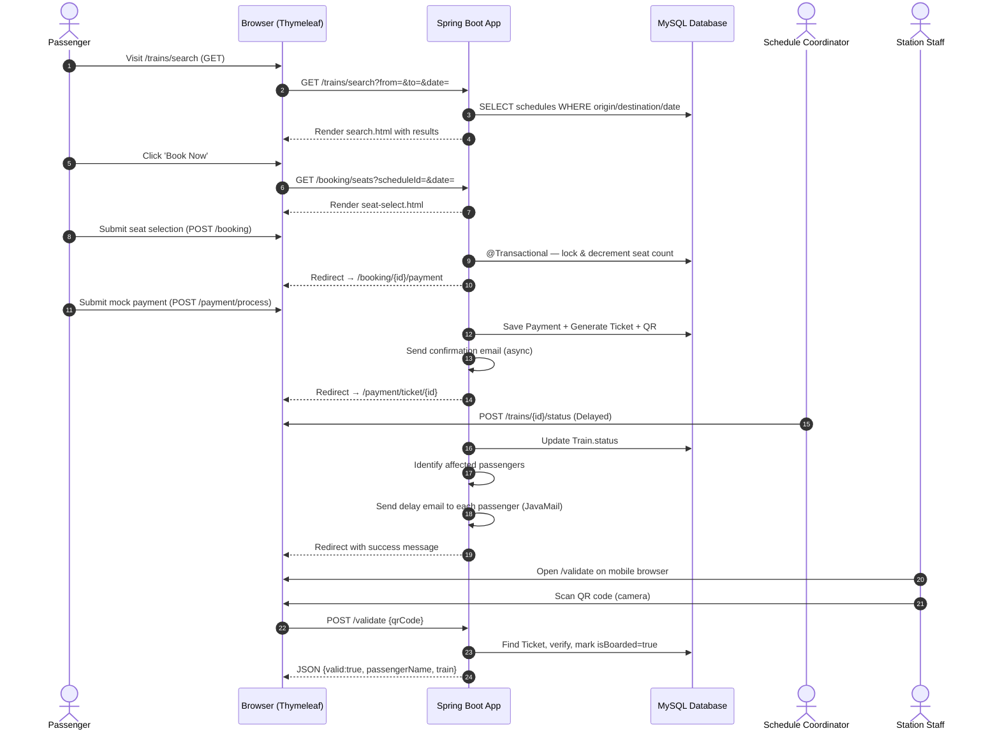
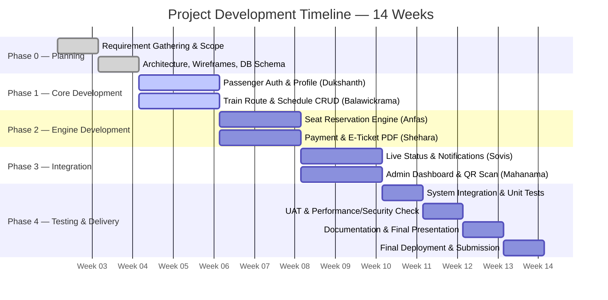

# 🚂 Web-based Train Scheduling & Booking System

[](https://github.com)
[](https://openjdk.org/projects/jdk/17/)
[](https://spring.io/projects/spring-boot)
[](https://www.mysql.com/)
[](https://opensource.org/licenses/MIT)
[](https://github.com)

---

> **SE2030 — Software Engineering | Year 2, Semester 1 — 2026**
> **Group: 2026-Y2-S1-MLB-B9G2-10 | Sri Lanka Institute of Information Technology (SLIIT)**
> A full-stack Java web application built with **Spring Boot 3**, **Thymeleaf**, and **MySQL** — delivering real-time seat reservation, automated passenger notifications, QR-based digital ticketing, and centralized administrative dashboards via a server-rendered web interface.

---

## 📑 Table of Contents

- [Overview](#-overview)
- [Objectives & Goals](#-objectives--goals)
- [Key Features](#-key-features)
- [System Architecture](#-system-architecture)
- [Tech Stack](#-tech-stack)
- [UI & Application Gallery](#-ui--application-gallery)
- [Workflow & Process Lifecycle](#-workflow--process-lifecycle)
- [Six Major Functions & Team Assignments](#-six-major-functions--team-assignments)
- [Minor / Utility Functions](#-minor--utility-functions)
- [Stakeholders & User Roles](#-stakeholders--user-roles)
- [Role-Based Access Control (RBAC)](#-role-based-access-control-rbac)
- [Non-Functional Requirements](#-non-functional-requirements)
- [Project Structure](#-project-structure)
- [Getting Started](#-getting-started)
  - [Prerequisites](#prerequisites)
  - [Database Setup](#database-setup)
  - [Configuration](#configuration)
  - [Running the Application](#running-the-application)
- [API Documentation](#-api-documentation)
- [Project Timeline & Milestones](#-project-timeline--milestones)
- [Testing & Quality Assurance](#-testing--quality-assurance)
- [System Constraints & Assumptions](#-system-constraints--assumptions)
- [Contributing](#-contributing)
- [License & Acknowledgments](#-license--acknowledgments)

---

## 🔬 Overview

The **Web-based Train Scheduling & Booking System** is a modernized platform designed to replace slow, error-prone manual railway operations. Built as a **monolithic Spring Boot application**, it delivers both the backend API and the server-rendered UI via **Thymeleaf templates** — all from a single deployable JAR.

The platform provides **passengers** with a seamless experience to search timetables, book seats, receive digital E-Tickets, and manage their trips online. **Railway management** gains centralized oversight to track revenues, manage schedules, update live statuses, and validate tickets via QR scanning.

```
                    +------------------------------------------------------+
                    |   Web-based Train Scheduling & Booking System         |
                    |        (Single Spring Boot Application)               |
                    +------------------------------------------------------+
                                             |
         +------------------+----------------+----------------+------------------+
         |                  |                                 |                  |
   +-----+------+    +------+--------+              +--------+--------+   +-----+------+
   | Passenger  |    | Reservation   |              | Admin Dashboard |   | Notification|
   | UI Pages   |    | & E-Ticketing |              | & QR Validation |   | Engine      |
   | (Thymeleaf)|    | Engine        |              | (Thymeleaf)     |   | (JavaMail)  |
   +------------+    +---------------+              +-----------------+   +-------------+
```

---

## 🎯 Objectives & Goals

| # | Objective | Description |
|:-:|:----------|:------------|
| 1 | **Centralized Operations** | Real-time dashboards for management to track daily revenues, active schedules, and delays. |
| 2 | **Prevent Overbooking** | Atomic seat inventory locking via `@Transactional` to synchronize bookings with physical train capacities. |
| 3 | **Automated Passenger Alerts** | Instant Email alerts via Spring Mail (JavaMailSender) when trains are delayed or cancelled. |
| 4 | **Digital Ticket Verification** | QR-code enabled E-Tickets for fast web-based scanning by station staff to eliminate fraud. |

---

## ⚡ Key Features

* 🔐 **Secure Authentication:** Spring Security form-login with BCrypt password hashing, session management, role-based access.
* 🔍 **Intelligent Route & Schedule Search:** Filter by origin, destination, date, and seat class with real-time availability.
* 💺 **Real-Time Seat Reservation & Inventory Lock:** `@Transactional` atomic operations prevent overbooking across concurrent requests.
* 💳 **Mock Payment Gateway & E-Ticket Generation:** Simulated payment processing; auto-generates downloadable PDF E-Tickets with QR codes via iText & ZXing.
* 📧 **Automated Email Notifications:** Spring Mail integration sends booking confirmations, delay alerts, and cancellation notices.
* 📊 **Executive Admin Dashboard:** KPIs, revenue summaries, booking volumes, and delay analytics via Thymeleaf + Chart.js.
* 📱 **Web-Based QR Ticket Validation:** Station staff use a mobile browser camera to scan and validate E-Tickets (`jsQR` library).
* ⭐ **Favorite Routes & Quick Rebooking:** Passengers save frequent routes for one-click repeat bookings.
* 🛤️ **Full Route & Timetable CRUD:** Admin creates, reads, updates, and deletes train routes, schedules, and coach seat capacities.
* 🔔 **Live Train Status Panel:** Admins update real-time statuses (On-time / Delayed / Cancelled) with automatic passenger notification dispatch.

---

## 🛠️ System Architecture

```
Browser (HTML/CSS/JS)
        │
        │  HTTP Requests (form POSTs, GET links)
        ▼
┌────────────────────────────────────────────────────────────────┐
│                  Spring Boot Application                        │
│                   (Embedded Tomcat)                            │
│                                                                │
│  ┌─────────────────────────────────────────────────────────┐  │
│  │              Spring MVC Controller Layer                 │  │
│  │  @Controller (returns Thymeleaf view names)             │  │
│  │  @RestController (returns JSON for JS/API callers)      │  │
│  └────────────────────┬────────────────────────────────────┘  │
│                       │                                        │
│  ┌────────────────────▼────────────────────────────────────┐  │
│  │              Service Layer (@Service)                    │  │
│  │  Business logic, seat locking, PDF generation           │  │
│  │  Email dispatch, QR code encoding                       │  │
│  └────────────────────┬────────────────────────────────────┘  │
│                       │                                        │
│  ┌────────────────────▼────────────────────────────────────┐  │
│  │     Repository Layer (Spring Data JPA)                  │  │
│  │     JpaRepository → Hibernate ORM → MySQL               │  │
│  └─────────────────────────────────────────────────────────┘  │
│                                                                │
│  ┌──────────────────┐  ┌──────────────────────────────────┐   │
│  │ Spring Security  │  │     Thymeleaf Template Engine     │   │
│  │ (Auth/AuthZ)     │  │  Renders HTML server-side         │   │
│  └──────────────────┘  └──────────────────────────────────┘   │
└────────────────────────────────────────────────────────────────┘
        │                          │
        ▼                          ▼
  ┌──────────┐              ┌──────────────┐
  │  MySQL   │              │  File System │
  │ Database │              │  (PDF/QR     │
  │          │              │   uploads)   │
  └──────────┘              └──────────────┘
```

> [!NOTE]
> This is a **server-side rendered (SSR)** architecture. Thymeleaf processes `.html` templates on the server and sends complete HTML pages to the browser — no separate frontend build step required. The application ships as a single self-contained JAR.

---

## 🛠️ Tech Stack

### Application Framework


### UI / Templating


### Database & ORM


### Build & Tools


### Libraries
| Library | Purpose |
|:--------|:--------|
| **iText 8** | PDF E-Ticket generation |
| **ZXing (Google)** | QR code encoding for E-Tickets |
| **Spring Mail** | Transactional email (JavaMailSender) |
| **JJWT 0.12** | JWT token generation & validation |
| **Chart.js** (CDN) | Revenue charts on admin dashboard |
| **jsQR** (CDN) | Browser-based QR code scanning |

---

## 🖼️ UI & Application Gallery

| **Passenger Search & Booking** | **Admin Dashboard** |
| :---: | :---: |
|  |  |
| *Search trains by route, date, and class — see live availability.* | *Revenue KPIs, booking volumes, and train delay monitoring.* |

| **E-Ticket with QR Code** | **QR Ticket Validation** |
| :---: | :---: |
|  |  |
| *PDF downloadable ticket with encrypted QR code.* | *Mobile web QR scanner for station staff boarding validation.* |

> [!TIP]
> Replace placeholders with real screenshots once the UI is implemented.

---

## 🔄 Workflow & Process Lifecycle

> [!NOTE]
> Seat locking uses `@Transactional` in the booking service — seats are atomically decremented on booking, preventing overbooking under concurrent requests.



---

## 👥 Six Major Functions & Team Assignments

### Function 1: Passenger Profile & Account Management
| Attribute | Detail |
|:----------|:-------|
| **Assigned To** | Dukshanth K. (IT25101520) |
| **Target User** | Passenger (End-User) |
| **Backend** | `features/auth/` + `features/passenger/` |
| **UI Templates** | `templates/auth/` + `templates/passenger/` |
| **Description** | Registration, login, password reset (Spring Security). Profile editing, booking history viewing, E-Ticket re-download, and saving favorite routes for quick rebooking. |

---

### Function 2: Train Route & Schedule Management (CRUD)
| Attribute | Detail |
|:----------|:-------|
| **Assigned To** | Balawickrama B.R.D. (IT25102327) |
| **Target User** | Schedule Coordinator (Admin) |
| **Backend** | `features/trains/` |
| **UI Templates** | `templates/trains/` |
| **Description** | Full CRUD for train routes, intermediate stops, and timetables. Admin sets coach seat capacities per class, push changes system-wide instantly via JPA. |

---

### Function 3: Real-Time Seat Reservation & Capacity Engine
| Attribute | Detail |
|:----------|:-------|
| **Assigned To** | Anfas M.S. (IT25103308) |
| **Target User** | Passenger (End-User) |
| **Backend** | `features/booking/BookingService.java` |
| **UI Templates** | `templates/booking/seat-select.html` |
| **Description** | Core booking engine. Checks live seat availability by schedule, date, and class. `@Transactional` seat locking halts overselling when capacity is reached. |

---

### Function 4: Payment Processing & E-Ticket Generation
| Attribute | Detail |
|:----------|:-------|
| **Assigned To** | Shehara D.M.D. (IT25100977) |
| **Target User** | Passenger (End-User) |
| **Backend** | `features/payment/` |
| **UI Templates** | `templates/booking/payment.html` + `eticket.html` |
| **Description** | Mock payment gateway form. Links payment to booking, generates PDF E-Tickets (iText) with ZXing-encoded QR codes. Emails ticket to passenger via Spring Mail. |

---

### Function 5: Live Status & Automated Notification System
| Attribute | Detail |
|:----------|:-------|
| **Assigned To** | Sovis W.M.A.V. (IT25102925) |
| **Target User** | Schedule Coordinator (Admin) & Passenger |
| **Backend** | `features/notifications/` |
| **UI Templates** | `templates/notifications/` |
| **Description** | Admin panel to update real-time train status (On-time, Delayed, Cancelled). System automatically queries affected passengers and dispatches Email alerts via JavaMailSender. |

---

### Function 6: Admin Dashboard & Station Ticket Validation
| Attribute | Detail |
|:----------|:-------|
| **Assigned To** | Mahanama M.N.S.T. (IT25100228) |
| **Target User** | Operations Manager & Station Staff |
| **Backend** | `features/dashboard/` |
| **UI Templates** | `templates/dashboard/` |
| **Description** | Executive dashboard with KPI stats (revenue, bookings, delays). Web-based mobile QR scanner (jsQR + getUserMedia) for station staff to validate E-Tickets and mark passengers as "Boarded." |

---

## 🔧 Minor / Utility Functions

| Utility | Description |
|:--------|:------------|
| **Authentication Utility** | Spring Security form login, BCrypt hashing, session management, logout. |
| **User Profile Utilities** | Profile data updates, favorite route management. |
| **Booking Utilities** | Route search filtering, booking history, E-Ticket re-download. |
| **Notification Utilities** | Email confirmation triggers on booking/payment and schedule changes. |
| **Administrative Utilities** | Dashboard KPI summaries, embedded QR scanning tool for station staff. |

---

## 🎭 Stakeholders & User Roles

| Role | Type | Spring Security Role | Primary Responsibilities |
|:-----|:-----|:---------------------|:------------------------|
| **Passenger** | External | `ROLE_PASSENGER` | Search, book, pay, download E-Tickets, manage profile. |
| **Schedule Coordinator** | Internal | `ROLE_COORDINATOR` | CRUD trains/routes/schedules, update live status. |
| **Operations Manager** | Internal | `ROLE_ADMIN` | Admin dashboard, revenue analytics. |
| **Station Staff** | Internal | `ROLE_STATION_STAFF` | QR ticket validation, mark boarded. |

---

## 🛡️ Role-Based Access Control (RBAC)

Spring Security `HttpSecurity` enforces route-level authorization:

```
+---------------------------+-------------+--------------------+--------------------+------------------+
| URL Pattern               | PASSENGER   | COORDINATOR        | ADMIN              | STATION_STAFF    |
+---------------------------+-------------+--------------------+--------------------+------------------+
| GET /trains/search        |     ✅      |         ✅         |         ✅         |       ✅         |
| POST /booking             |     ✅      |         ❌         |         ❌         |       ❌         |
| GET /booking-history      |  ✅ (own)   |         ❌         |         ❌         |       ❌         |
| GET/POST /payment/**      |     ✅      |         ❌         |         ❌         |       ❌         |
| GET/POST /trains/manage   |     ❌      |         ✅         |         ✅         |       ❌         |
| POST /trains/{id}/status  |     ❌      |         ✅         |         ✅         |       ❌         |
| GET /dashboard            |     ❌      |         ❌         |         ✅         |       ❌         |
| POST /validate            |     ❌      |         ❌         |         ❌         |       ✅         |
| /swagger-ui/**            |     ✅      |         ✅         |         ✅         |       ✅         |
+---------------------------+-------------+--------------------+--------------------+------------------+
```

---

## 📐 Non-Functional Requirements

| Quality Attribute | Implementation Approach |
|:------------------|:-----------------------|
| **Performance** | Spring Data JPA with indexed queries; `@Transactional` for atomic seat locking. |
| **Security** | Spring Security BCrypt passwords; CSRF protection; role-based URL authorization. |
| **Reliability** | Hibernate `ddl-auto=update`; Spring `@Transactional` rollback on failure. |
| **Usability** | Thymeleaf server-side rendered pages with vanilla CSS — mobile responsive. |
| **Availability** | Embedded Tomcat; no external runtime dependencies beyond JDK and MySQL. |
| **Scalability** | Stateless session management; can be deployed as a containerized JAR. |

---

## 📁 Project Structure

The project is a **single Spring Boot Maven project**. Each team member's feature domain is isolated in its own package under `features/`.

```
project/
├── README.md
├── .gitignore
│
└── backend/                                     ← THE ENTIRE APPLICATION
    ├── pom.xml                                  ← Maven build (all deps)
    ├── .env.example                             ← Config template
    ├── .gitignore
    │
    └── src/
        ├── main/
        │   ├── java/com/trainbooking/
        │   │   ├── TrainBookingApplication.java ← Entry point (@SpringBootApplication)
        │   │   │
        │   │   ├── config/                      ← Cross-cutting config
        │   │   │   ├── SecurityConfig.java      ← Spring Security rules
        │   │   │   ├── WebMvcConfig.java        ← CORS, static resources
        │   │   │   └── OpenApiConfig.java       ← Swagger setup
        │   │   │
        │   │   ├── security/                    ← JWT & UserDetails
        │   │   │   ├── JwtUtil.java
        │   │   │   └── UserDetailsServiceImpl.java
        │   │   │
        │   │   ├── exception/                   ← Global error handling
        │   │   │   ├── GlobalExceptionHandler.java
        │   │   │   └── ResourceNotFoundException.java
        │   │   │
        │   │   └── features/                    ← 🔑 Feature domains
        │   │       ├── auth/                    ← 👤 Dukshanth K. (IT25101520)
        │   │       │   ├── AuthController.java
        │   │       │   ├── AuthService.java
        │   │       │   └── dto/
        │   │       │
        │   │       ├── passenger/               ← 👤 Dukshanth K. (IT25101520)
        │   │       │   ├── PassengerController.java
        │   │       │   ├── PassengerService.java
        │   │       │   ├── model/  (User, FavoriteRoute)
        │   │       │   ├── repository/
        │   │       │   └── dto/
        │   │       │
        │   │       ├── trains/                  ← 👤 Balawickrama B.R.D. (IT25102327)
        │   │       │   ├── TrainController.java
        │   │       │   ├── TrainService.java
        │   │       │   ├── ScheduleController.java
        │   │       │   ├── ScheduleService.java
        │   │       │   ├── model/  (Train, Route, Schedule)
        │   │       │   ├── repository/
        │   │       │   └── dto/
        │   │       │
        │   │       ├── booking/                 ← 👤 Anfas M.S. (IT25103308)
        │   │       │   ├── BookingController.java
        │   │       │   ├── BookingService.java
        │   │       │   ├── model/  (Booking, Seat)
        │   │       │   ├── repository/
        │   │       │   └── dto/
        │   │       │
        │   │       ├── payment/                 ← 👤 Shehara D.M.D. (IT25100977)
        │   │       │   ├── PaymentController.java
        │   │       │   ├── PaymentService.java
        │   │       │   ├── model/  (Payment, Ticket)
        │   │       │   ├── repository/
        │   │       │   └── dto/
        │   │       │
        │   │       ├── notifications/           ← 👤 Sovis W.M.A.V. (IT25102925)
        │   │       │   ├── NotificationController.java
        │   │       │   ├── NotificationService.java
        │   │       │   ├── EmailService.java
        │   │       │   ├── model/  (Notification)
        │   │       │   ├── repository/
        │   │       │   └── dto/
        │   │       │
        │   │       └── dashboard/               ← 👤 Mahanama M.N.S.T. (IT25100228)
        │   │           ├── DashboardController.java
        │   │           ├── DashboardService.java
        │   │           ├── TicketValidationController.java
        │   │           ├── TicketValidationService.java
        │   │           └── dto/
        │   │
        │   └── resources/
        │       ├── application.properties       ← DB, JPA, mail, JWT config
        │       ├── application-dev.properties   ← Dev overrides
        │       │
        │       ├── templates/                   ← 🎨 Thymeleaf HTML pages (THE UI)
        │       │   ├── layout/
        │       │   │   ├── base.html            ← Main layout (nav + footer)
        │       │   │   └── admin-base.html      ← Admin layout (nav + sidebar)
        │       │   ├── auth/          (login, register, forgot-password)
        │       │   ├── passenger/     (profile, booking-history)
        │       │   ├── trains/        (search, manage)
        │       │   ├── booking/       (seat-select, payment, eticket)
        │       │   ├── notifications/ (list, status)
        │       │   ├── dashboard/     (index, validate)
        │       │   └── error/         (404, 500)
        │       │
        │       └── static/                      ← Served as-is (CSS, JS, images)
        │           ├── css/
        │           │   ├── variables.css        ← Design tokens
        │           │   └── global.css           ← All styles
        │           ├── js/
        │           │   ├── main.js              ← Common UI logic
        │           │   └── qr-scanner.js        ← Camera QR scanning
        │           └── images/
        │
        └── test/
            └── java/com/trainbooking/
                └── features/                    ← Unit & integration tests
```

> [!TIP]
> **For team members:** Each developer works inside their `features/<domain>/` package on the Java side, and the matching `templates/<domain>/` folder on the UI side. `config/`, `security/`, and `exception/` are shared — coordinate changes via PR reviews.

---

## 🚀 Getting Started

### Prerequisites

Ensure the following are installed and available in your `PATH`:

| Tool | Version | Check Command |
|:-----|:--------|:--------------|
| **Java JDK** | 17 or higher | `java -version` |
| **Apache Maven** | 3.8+ | `mvn -version` |
| **MySQL** | 8.0+ (via XAMPP or standalone) | Start via XAMPP Control Panel |
| **Git** | Latest | `git --version` |

---

### Database Setup

1. **Start MySQL** via XAMPP Control Panel (click **Start** next to MySQL).
2. Open phpMyAdmin at `http://localhost/phpmyadmin` OR use MySQL CLI:
   ```sql
   mysql -u root -p
   CREATE DATABASE train_booking_db;
   ```
3. **That's it.** Spring Boot will auto-create all tables on first run via `spring.jpa.hibernate.ddl-auto=update`.

---

### Configuration

The default `application.properties` is pre-configured for XAMPP MySQL (root user, no password). If your setup differs, edit:

```
backend/src/main/resources/application.properties
```

Key settings:

```properties
# Database
spring.datasource.url=jdbc:mysql://localhost:3306/train_booking_db?createDatabaseIfNotExist=true
spring.datasource.username=root
spring.datasource.password=          ← Leave blank for XAMPP default

# JWT Secret (change in production)
app.jwt.secret=your-256-bit-secret-key

# Mail (update with real SMTP when ready)
spring.mail.host=smtp.mailtrap.io
spring.mail.username=your_username
spring.mail.password=your_password
```

---

### Running the Application

```bash
# Navigate to the backend directory
cd backend

# Run the Spring Boot application
mvn spring-boot:run
```

The application starts on **`http://localhost:8080`**. All tables are created automatically on startup.

| URL | What you see |
|:----|:-------------|
| `http://localhost:8080` | App home — train search page |
| `http://localhost:8080/login` | Login page |
| `http://localhost:8080/register` | Registration page |
| `http://localhost:8080/dashboard` | Admin dashboard (requires ADMIN role) |
| `http://localhost:8080/validate` | QR ticket validation (requires STATION_STAFF role) |
| `http://localhost:8080/swagger-ui.html` | Interactive REST API documentation |
| `http://localhost:8080/api/health` | API health check JSON |

#### Building a deployable JAR

```bash
cd backend
mvn clean package
java -jar target/train-booking-system-1.0.0.jar
```

---

## 📡 API Documentation

Interactive Swagger UI is available at `http://localhost:8080/swagger-ui.html` when the server is running.

### Authentication

| Method | URL | Description | Access |
|:-------|:----|:------------|:-------|
| `GET` | `/login` | Login page | Public |
| `POST` | `/login` | Authenticate (form submit) | Public |
| `GET` | `/register` | Registration page | Public |
| `POST` | `/register` | Create account | Public |
| `POST` | `/logout` | Logout | Authenticated |

### Train Search & Management

| Method | URL | Description | Access |
|:-------|:----|:------------|:-------|
| `GET` | `/trains/search` | Search trains by route & date | Public |
| `GET` | `/trains/manage` | Admin train list | COORDINATOR / ADMIN |
| `POST` | `/trains` | Create new train | COORDINATOR / ADMIN |
| `POST` | `/trains/{id}` | Update train | COORDINATOR / ADMIN |
| `POST` | `/trains/{id}/delete` | Delete train | COORDINATOR / ADMIN |
| `POST` | `/trains/{id}/status` | Update live status | COORDINATOR / ADMIN |

### Booking & Payment

| Method | URL | Description | Access |
|:-------|:----|:------------|:-------|
| `GET` | `/booking/seats` | Seat selection page | PASSENGER |
| `POST` | `/booking` | Create booking (atomic) | PASSENGER |
| `POST` | `/payment/process` | Process mock payment | PASSENGER |
| `GET` | `/payment/ticket/{id}` | View E-Ticket | PASSENGER |
| `GET` | `/payment/ticket/{id}/download` | Download PDF ticket | PASSENGER |

### Dashboard & Validation

| Method | URL | Description | Access |
|:-------|:----|:------------|:-------|
| `GET` | `/dashboard` | Admin KPI dashboard | ADMIN |
| `GET` | `/dashboard/revenue` | Revenue data (JSON) | ADMIN |
| `GET` | `/validate` | QR scanner page | STATION_STAFF |
| `POST` | `/validate` | Validate QR code (JSON) | STATION_STAFF |

### Health

| Method | URL | Description | Access |
|:-------|:----|:------------|:-------|
| `GET` | `/api/health` | Server health check | Public |

---

## 📅 Project Timeline & Milestones



| Week | Phase | Deliverables |
|:-----|:------|:-------------|
| **Week 3** | Planning | Requirements finalised, project scope confirmed. |
| **Week 4** | Planning | Spring Boot architecture, Thymeleaf wireframes, MySQL schema designed. |
| **Week 5–6** | Phase 1 | Auth + Passenger features; Train Route & Schedule CRUD. |
| **Week 7–8** | Phase 2 | Seat Reservation engine; Payment + E-Ticket PDF + QR generation. |
| **Week 9–10** | Phase 3 | Live Status + Notification emails; Admin Dashboard + QR Validator. |
| **Week 11** | Testing | System integration, unit tests, bug fixing across all modules. |
| **Week 12** | Testing | End-to-End UAT, performance and security verification. |
| **Week 13** | Delivery | Documentation complete, final presentation prepared. |
| **Week 14** | Delivery | Final deployment and project submission. |

---

## 🧪 Testing & Quality Assurance

```bash
# Run all tests
cd backend
mvn test

# Run tests with coverage report
mvn test jacoco:report
# Report: target/site/jacoco/index.html

# Run a specific test class
mvn test -Dtest=BookingServiceTest
```

| Test Type | Scope | Tools |
|:----------|:------|:------|
| **Unit Testing** | Service layer, utility methods | JUnit 5, Mockito |
| **Integration Testing** | Controller endpoints, DB interactions | Spring Boot Test, MockMvc |
| **Security Testing** | Auth, RBAC rules | Spring Security Test |
| **Functional/E2E** | Full user flows in browser | Manual (Week 12) |
| **Performance** | Concurrent booking requests | Manual + JMeter |

---

## ⚠️ System Constraints & Assumptions

### Constraints

| Constraint | Details |
|:-----------|:--------|
| **Payment Processing** | Uses a **mock payment gateway** — no real banking integration. |
| **Email Notifications** | Requires SMTP credentials (Mailtrap for dev; Gmail/SendGrid for production). |
| **Hardware (QR Scan)** | Station staff need a web-enabled device with a camera (Chrome/Firefox). |
| **Connectivity** | Online access required for live seat updates and ticket validation. |
| **MySQL Availability** | Application connects to MySQL on port 3306 — start XAMPP before running. |

### Assumptions

| # | Assumption |
|:-:|:-----------|
| 1 | MySQL is running locally via XAMPP (root user, no password by default). |
| 2 | Passengers register valid, active email addresses for E-Tickets and alerts. |
| 3 | Operational staff supply accurate, real-time schedule inputs into the system. |

---

## 🤝 Contributing

### Branching Strategy

Each team member works on a dedicated feature branch:

```
main
└── develop
    ├── feature/auth-passenger-management         ← Dukshanth K.
    ├── feature/train-route-schedule-crud          ← Balawickrama B.R.D.
    ├── feature/seat-reservation-engine            ← Anfas M.S.
    ├── feature/payment-eticket-pdf-qr             ← Shehara D.M.D.
    ├── feature/live-status-notifications          ← Sovis W.M.A.V.
    └── feature/admin-dashboard-qr-validation      ← Mahanama M.N.S.T.
```

### Workflow

1. Pull latest `develop` branch
2. Create feature branch: `git checkout -b feature/your-feature`
3. Write code in your assigned `features/<domain>/` package
4. Commit with clear messages: `git commit -m "feat: add seat availability check"`
5. Push and open a Pull Request against `develop`
6. Require at least **one peer review** before merge

### Commit Convention

```
feat:     New feature
fix:      Bug fix
docs:     Documentation update
style:    Formatting only (no logic change)
refactor: Code restructure, no behavior change
test:     Add/update tests
chore:    Maven, build scripts, config
```

---

## 📜 License & Acknowledgments

Distributed under the MIT License. See `LICENSE` for details.

### Team Members & Function Assignments

| IT Number | Name | Feature Domain | Package |
|:----------|:-----|:---------------|:--------|
| IT25101520 | **Dukshanth K.** | Passenger Profile & Account Management | `features/auth/` + `features/passenger/` |
| IT25102327 | **Balawickrama B.R.D.** | Train Route & Schedule Management | `features/trains/` |
| IT25103308 | **Anfas M.S.** | Real-Time Seat Reservation & Capacity Engine | `features/booking/` |
| IT25100977 | **Shehara D.M.D.** | Payment Processing & E-Ticket Generation | `features/payment/` |
| IT25102925 | **Sovis W.M.A.V.** | Live Status & Automated Notification System | `features/notifications/` |
| IT25100228 | **Mahanama M.N.S.T.** | Admin Dashboard & Station Ticket Validation | `features/dashboard/` |

### Acknowledgments

- **Sri Lanka Institute of Information Technology (SLIIT)** — SE2030 Software Engineering Module
- Spring Boot, Thymeleaf, Hibernate, iText, ZXing open-source communities

---

<p align="center">
  Designed & Developed by <b>2026-Y2-S1-MLB-B9G2-10</b> for the <b>SE2030 — Software Engineering Project</b><br/>
  Sri Lanka Institute of Information Technology (SLIIT) — 2026<br/>
  <b>Stack: Java 17 + Spring Boot 3 + Thymeleaf + MySQL</b>
</p>
