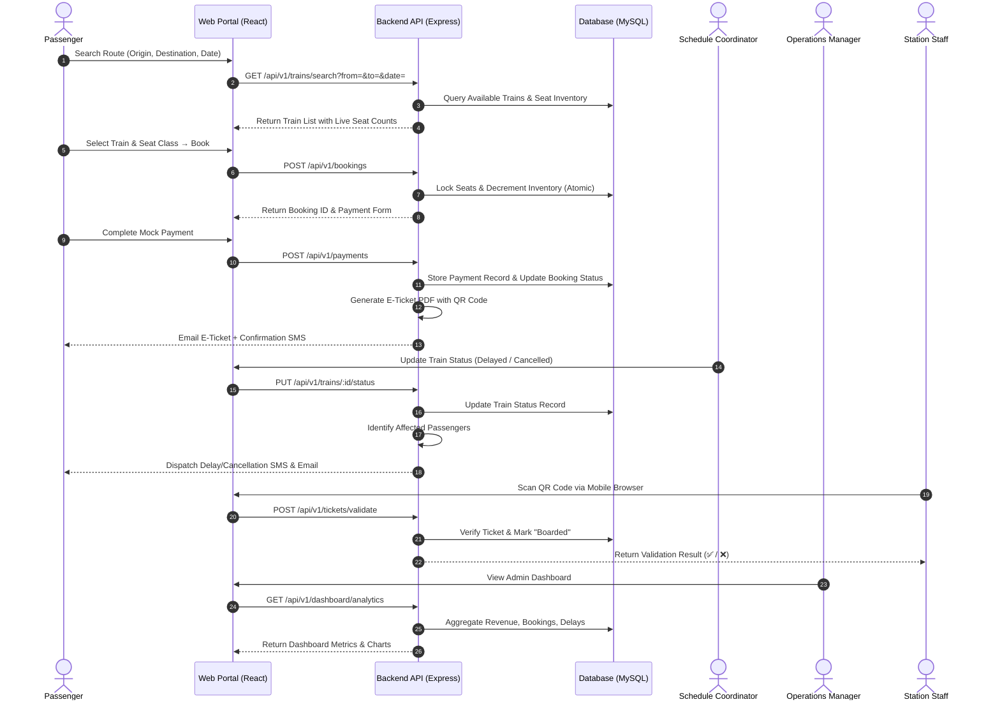
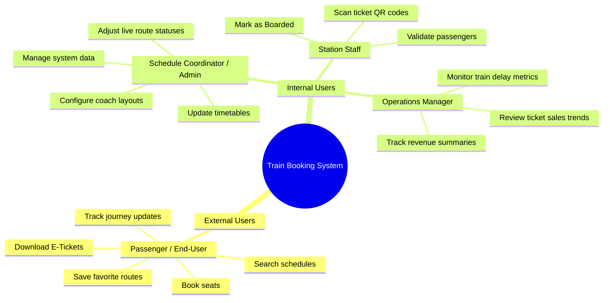
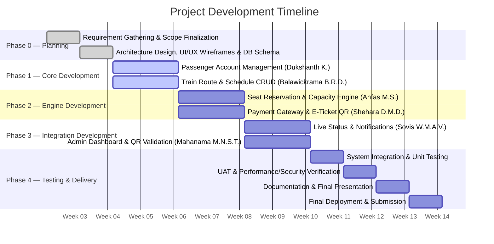

# 🚂 Web-based Train Scheduling & Booking System

[](https://github.com)
[](https://opensource.org/licenses/MIT)
[](http://makeapullrequest.com)
[](https://github.com)
[](https://github.com)

---

> **SE2030 — Software Engineering | Year 2, Semester 1 — 2026**  
> **Group: 2026-Y2-S1-MLB-B9G2-10 | Sri Lanka Institute of Information Technology (SLIIT)**  
> A modernized, full-stack web platform that replaces manual railway operations with real-time seat reservation, automated passenger notifications, QR-based digital ticketing, and centralized administrative dashboards — delivering a seamless, end-to-end train scheduling and booking experience.

---

## 📑 Table of Contents

- [Overview](#-overview)
- [Objectives & Goals](#-objectives--goals)
- [Key Features](#-key-features)
- [System Architecture](#-system-architecture)
- [Tech Stack](#-tech-stack)
- [UI & Application Gallery](#-ui--application-gallery)
- [Workflow & Process Lifecycle](#-workflow--process-lifecycle)
- [Six Major Functions & Team Assignments](#-six-major-functions--team-assignments)
- [Minor / Utility Functions](#-minor--utility-functions)
- [Stakeholders & User Roles](#-stakeholders--user-roles)
- [Role-Based Access Control (RBAC)](#-role-based-access-control-rbac)
- [Non-Functional Requirements](#-non-functional-requirements)
- [Project Structure](#-project-structure)
- [Getting Started](#-getting-started)
  - [Prerequisites](#prerequisites)
  - [Installation](#installation)
  - [Environment Configuration](#environment-configuration)
  - [Database Setup](#database-setup)
  - [Running the Application](#running-the-application)
- [API Documentation](#-api-documentation)
- [Project Timeline & Milestones](#-project-timeline--milestones)
- [Testing & Quality Assurance](#-testing--quality-assurance)
- [System Constraints & Assumptions](#-system-constraints--assumptions)
- [Contributing](#-contributing)
- [License & Acknowledgments](#-license--acknowledgments)

---

## 🔬 Overview

The **Web-based Train Scheduling & Booking System** is a modernized platform designed to replace slow, error-prone manual railway operations. The platform offers a centralized solution for **passengers** to check timetables, book seats, receive digital E-Tickets, and manage their trips online. Simultaneously, it provides **railway management** with centralized oversight to track revenues, manage schedules, and monitor train delays.

Built as part of the **SE2030 — Software Engineering** curriculum at SLIIT, this project delivers a scalable, role-governed platform capable of handling real-time seat reservation with inventory locking, dynamic fare calculation, automated multi-channel passenger notifications, encrypted QR-code E-Ticket generation, and executive operational dashboards — all within a secure, responsive web interface.

```
                    +------------------------------------------------------+
                    |     Web-based Train Scheduling & Booking System       |
                    +------------------------------------------------------+
                                             |
         +------------------+----------------+----------------+------------------+
         |                  |                                 |                  |
   +-----+------+    +------+--------+              +--------+--------+   +-----+------+
   | Passenger  |    | Reservation   |              | Admin Dashboard |   | Notification|
   |  Portal    |    | & Ticketing   |              | & Validation    |   | Engine      |
   +------------+    | Engine        |              +-----------------+   +-------------+
                     +---------------+
```

---

## 🎯 Objectives & Goals

| # | Objective | Description |
|:-:|:----------|:------------|
| 1 | **Centralized Operations** | Deliver real-time dashboards for management to track daily revenues, active schedules, and delays. |
| 2 | **Prevent Overbooking** | Implement automatic inventory locking to synchronize online ticket sales directly with physical train capacities. |
| 3 | **Automated Passenger Alerts** | Send instant Email/SMS alerts to passengers regarding train delays, schedule updates, or cancellations. |
| 4 | **Digital Ticket Verification** | Provide QR-code enabled E-Tickets for fast scanning by station staff to eliminate ticket fraud and reduce station congestion. |

---

## ⚡ Key Features

* 🔐 **Secure Passenger Authentication:** Full registration, login, logout, and self-service password reset with JWT-based session management.
* 🔍 **Intelligent Route & Schedule Search:** Filter by origin, destination, travel date, and seat class with real-time availability indicators.
* 💺 **Real-Time Seat Reservation & Inventory Lock:** Dynamically updates seat availability across all channels; locks selected seats during transaction processing and halts sales at maximum capacity.
* 💳 **Mock Payment Gateway & E-Ticket Generation:** Processes payments through a simulated gateway; auto-generates downloadable PDF E-Tickets with journey details, fare breakdown, and encrypted QR codes.
* 📧 **Automated Multi-Channel Notifications:** Instant Email/SMS alerts for booking confirmations, train delays, cancellations, and schedule changes via Twilio/SendGrid integration.
* 📊 **Executive Admin Dashboard:** Key performance metrics, daily revenue summaries, ticket booking volumes, and train delay analytics at a glance.
* 📱 **Web-Based QR Ticket Validation:** Station staff scan E-Ticket QR codes via mobile web browser to validate passengers and mark them as "Boarded."
* ⭐ **Favorite Routes & Quick Rebooking:** Passengers save frequent routes for one-tap repeat bookings and access full booking history with E-Ticket re-download.
* 🛤️ **Full Route & Timetable CRUD:** Administrators create, view, modify, or delete train routes, intermediate stops, schedules, and coach seat capacities per class.
* 🔔 **Live Train Status Panel:** Admins update real-time statuses (On-time / Delayed / Cancelled) with automatic passenger notification dispatch.

---

## 🛠️ System Architecture

```
                                      +--------------------------+
                                      |       Client Layer       |
                                      |  (React / Responsive UI) |
                                      +------------+-------------+
                                                   |
                                                   v [HTTPS / REST API]
                                                   |
                                      +------------+-------------+
                                      |    API Gateway / Node    |
                                      |     (Express.js + JWT)   |
                                      +------------+-------------+
                                                   |
                    +-----------------------------+-----------------------------+
                    |                             |                             |
                    v                             v                             v
         +-------------------+         +---------------------+        +-------------------+
         |   Auth Service    |         |  Business Logic     |        |  Media & QR Code  |
         |  (JWT / Bcrypt)   |         |  Engine             |        |  Service           |
         +--------+----------+         +----------+----------+        +-------------------+
                  |                               |                             |
                  |      +------------------------+                             |
                  |      |                                                      |
                  v      v                                                      v
         +-------------------+                                       +-------------------+
         |  MySQL Database   |                                       | File Storage /    |
         |  (Local / Cloud)  |                                       | Cloud Uploads     |
         +-------------------+                                       +-------------------+
                  |
                  v
         +-------------------+
         | Notification      |
         | Gateway           |
         | (Email / SMS API) |
         +-------------------+
```

> [!NOTE]
> The architecture follows a layered monolithic design suitable for academic scope, with clear separation of concerns across authentication, business logic, media handling, and notification services. The system can be extended to a microservices architecture for production-grade scaling.

---

## 🛠️ Tech Stack

### Frontend


### Backend


### Database & Storage


### Notifications & Integrations


### DevOps & Tools


---

## 🖼️ UI & Application Gallery

Below are visual previews of the key modules in the Train Scheduling & Booking System:

| **Passenger Registration & Login** | **Route Search & Booking** |
| :---: | :---: |
|  |  |
| *Secure sign-up / login with profile management.* | *Search trains by origin, destination & date, view live availability.* |

| **E-Ticket with QR Code** | **Admin Dashboard & Analytics** |
| :---: | :---: |
|  |  |
| *Auto-generated PDF ticket with encrypted QR code.* | *Revenue tracking, booking volumes & real-time delay monitoring.* |

> [!TIP]
> Replace the placeholder images above with actual screenshots once the UI implementation is complete.

---

## 🔄 Workflow & Process Lifecycle

> [!NOTE]
> The lifecycle guarantees real-time seat locking during the booking flow, preventing overbooking across concurrent sessions.



---

## 👥 Six Major Functions & Team Assignments

Each major function is assigned to an individual team member as an isolated functional domain, ensuring clear ownership and accountability.

### Function 1: Passenger Profile & Account Management
| Attribute | Detail |
|:----------|:-------|
| **Assigned To** | Dukshanth K. (IT25101520) |
| **Target User** | Passenger (End-User) |
| **Description** | Provides user authentication including registration, login, and password reset. Enables passengers to save personal contact details for faster checkout, view their full booking history, redownload past E-Tickets, and save favorite travel routes for quick rebooking. |

---

### Function 2: Train Route & Schedule Management (CRUD)
| Attribute | Detail |
|:----------|:-------|
| **Assigned To** | Balawickrama B.R.D. (IT25102327) |
| **Target User** | Schedule Coordinator (Admin) |
| **Description** | Supplies administrators with CRUD tools to create, view, modify, or delete train routes, intermediate stops, and schedules. Allows admins to set coach seat capacities per class and instantly push timetable changes across the system. |

---

### Function 3: Real-Time Seat Reservation & Capacity Engine
| Attribute | Detail |
|:----------|:-------|
| **Assigned To** | Anfas M.S. (IT25103308) |
| **Target User** | Passenger (End-User) |
| **Description** | Drives the core booking engine by checking live seat availability based on travel dates and seat class. Calculates dynamic fares, locks selected seats during transaction processing, and halts ticket sales automatically when a train reaches maximum capacity. |

---

### Function 4: Payment Processing & E-Ticket Generation
| Attribute | Detail |
|:----------|:-------|
| **Assigned To** | Shehara D.M.D. (IT25100977) |
| **Target User** | Passenger (End-User) |
| **Description** | Processes payments through a mock payment gateway form and links payment confirmation records to the booking. Automatically generates downloadable PDF E-Tickets containing journey details, passenger information, payment status, and a scannable QR code, which is emailed to the passenger. |

---

### Function 5: Live Status & Automated Notification System
| Attribute | Detail |
|:----------|:-------|
| **Assigned To** | Sovis W.M.A.V. (IT25102925) |
| **Target User** | Schedule Coordinator (Admin) & Passenger |
| **Description** | Gives admins an operational panel to update real-time train statuses (On-time, Delayed, Cancelled). The system automatically identifies passengers on affected routes and dispatches instant Email/SMS alerts detailing delays or alternative options. |

---

### Function 6: Admin Dashboard & Station Ticket Validation
| Attribute | Detail |
|:----------|:-------|
| **Assigned To** | Mahanama M.N.S.T. (IT25100228) |
| **Target User** | Operations Manager & Station Staff |
| **Description** | Features an executive dashboard displaying key performance metrics, daily revenue summaries, and ticket booking volumes. Includes a web-based mobile QR code scanner tool for station staff to validate E-Tickets and mark them as "Boarded" to avoid duplicate usage. |

---

## 🔧 Minor / Utility Functions

The system incorporates essential utility features to ensure smooth daily operation:

| Utility | Description |
|:--------|:------------|
| **Authentication Utility** | Secure user registration, login, logout, and self-service password reset functionality. |
| **User Profile Utilities** | Profile updates for personal contact details and a designated section to manage saved "Favorite Routes" for fast, repeat bookings. |
| **Booking Utilities** | Route search filtering (by origin, destination, and travel date), booking history viewing, and E-Ticket re-download options. |
| **Notification Utilities** | Instant email confirmation triggers following successful seat payments or schedule modifications. |
| **Administrative Utilities** | High-level dashboard reporting summaries and embedded web-based QR code ticket scanning tools for station staff. |

---

## 🎭 Stakeholders & User Roles



| Role | Type | Primary Responsibilities |
|:-----|:-----|:------------------------|
| **Passenger (End-User)** | External | Register, search schedules, book seats, download E-Tickets, save favorite routes, track journey updates. |
| **Schedule Coordinator (Admin)** | Internal | Manage system data, configure coach configurations, update train timetables, adjust live route statuses. |
| **Operations Manager** | Internal | Utilize operational dashboards to track revenue summaries, review ticket sales trends, monitor train delay metrics. |
| **Station Staff** | Internal | Scan ticket QR codes using mobile devices to validate passengers prior to boarding. |

---

## 🛡️ Role-Based Access Control (RBAC)

The system enforces granular authorization matrices ensuring each user type can only access permitted resources:

```
+---------------------------+------------------+----------------------+--------------------+-----------------+
| Permission / Action       | Passenger        | Schedule Coordinator | Operations Manager | Station Staff   |
+---------------------------+------------------+----------------------+--------------------+-----------------+
| Register / Login          |        ✅        |          ✅          |         ✅         |       ✅        |
| Search Routes & Trains    |        ✅        |          ✅          |         ✅         |       ❌        |
| Book Seats & Pay          |        ✅        |          ❌          |         ❌         |       ❌        |
| View Own Booking History  |     ✅ (Own)     |          ❌          |         ❌         |       ❌        |
| Download / Redownload     |     ✅ (Own)     |          ❌          |         ❌         |       ❌        |
| E-Tickets                 |                  |                      |                    |                 |
| Manage Routes (CRUD)      |        ❌        |          ✅          |         ❌         |       ❌        |
| Manage Schedules (CRUD)   |        ❌        |          ✅          |         ❌         |       ❌        |
| Update Train Live Status  |        ❌        |          ✅          |         ❌         |       ❌        |
| View Admin Dashboard      |        ❌        |          ❌          |         ✅         |       ❌        |
| View Revenue Analytics    |        ❌        |          ❌          |         ✅         |       ❌        |
| Scan QR / Validate Ticket |        ❌        |          ❌          |         ❌         |       ✅        |
| Mark Passenger as Boarded |        ❌        |          ❌          |         ❌         |       ✅        |
| User Management           |        ❌        |          ✅          |         ❌         |       ❌        |
+---------------------------+------------------+----------------------+--------------------+-----------------+
```

---

## 📐 Non-Functional Requirements

| Quality Attribute | Requirement Description |
|:------------------|:-----------------------|
| **Performance** | Delivers fast search query results and updates real-time seat availability instantaneously upon booking. |
| **Security** | Implements secure user authentication, safe payment processing handling, and encrypted QR code validation. |
| **Reliability** | Maintains accurate booking and inventory records alongside regular data backups. |
| **Usability** | Features a responsive, modern, user-friendly interface optimized for web and mobile browsers. |
| **Availability** | Ensures high availability (24/7 access) for passenger searching and ticket booking. |
| **Scalability** | Built to scale effectively to handle increasing passenger traffic and high transaction volumes during peak travel periods. |

---

## 📁 Project Structure

The project follows a **feature-based architecture** where each team member's functional domain is isolated into its own feature folder — minimizing merge conflicts and enabling parallel development.

```
project/
├── README.md                          # This file
├── frontend/                          # React + Vite client application
│   ├── public/                        # Static public assets
│   ├── .env.example                   # Frontend environment template
│   ├── vite.config.js                 # Vite build configuration
│   ├── package.json
│   └── src/
│       ├── main.jsx                   # Application entry point
│       ├── App.jsx                    # Root component (providers + routes)
│       ├── assets/                    # Static assets (images, fonts, icons)
│       │   ├── images/
│       │   ├── fonts/
│       │   └── icons/
│       ├── styles/                    # Global styles & design tokens
│       │   ├── global.css             # CSS reset & base styles
│       │   └── variables.css          # CSS custom properties / design tokens
│       ├── components/                # Shared, reusable UI components
│       │   ├── common/                # Button, Input, Modal, Card, Loader, Alert, Badge
│       │   └── layout/                # Header, Footer, Sidebar, MainLayout, AdminLayout
│       ├── features/                  # 🔑 Feature modules (one per team member)
│       │   ├── auth/                  # 👤 Dukshanth K. — Login, Register, Forgot Password
│       │   │   ├── components/        #     LoginForm, RegisterForm
│       │   │   └── pages/             #     LoginPage, RegisterPage, ForgotPasswordPage
│       │   ├── passenger/             # 👤 Dukshanth K. — Profile, Favorites, History
│       │   │   ├── components/        #     ProfileCard, FavoriteRoutes, BookingHistory
│       │   │   └── pages/             #     ProfilePage, BookingHistoryPage
│       │   ├── trains/                # 👤 Balawickrama B.R.D. — Routes, Schedules, Search
│       │   │   ├── components/        #     TrainSearchForm, TrainCard, ScheduleTable
│       │   │   └── pages/             #     SearchPage, TrainManagementPage
│       │   ├── booking/               # 👤 Anfas M.S. + Shehara D.M.D. — Reservation & Payment
│       │   │   ├── components/        #     SeatSelector, FareSummary, PaymentForm
│       │   │   └── pages/             #     BookingPage, PaymentPage, ETicketPage
│       │   ├── notifications/         # 👤 Sovis W.M.A.V. — Live Status & Alerts
│       │   │   ├── components/        #     NotificationList, TrainStatusPanel
│       │   │   └── pages/             #     NotificationsPage, TrainStatusPage
│       │   └── dashboard/             # 👤 Mahanama M.N.S.T. — Admin Dashboard & QR Validation
│       │       ├── components/        #     RevenueChart, BookingStats, QRScanner
│       │       └── pages/             #     DashboardPage, TicketValidationPage
│       ├── services/                  # API service layer (Axios calls)
│       │   ├── api.js                 # Axios instance with JWT interceptors
│       │   ├── auth.service.js
│       │   ├── train.service.js
│       │   ├── booking.service.js
│       │   ├── notification.service.js
│       │   └── dashboard.service.js
│       ├── hooks/                     # Custom React hooks
│       │   ├── useAuth.js
│       │   ├── useDebounce.js
│       │   └── useLocalStorage.js
│       ├── context/                   # React context providers
│       │   ├── AuthContext.jsx
│       │   └── ThemeContext.jsx
│       ├── routes/                    # Route definitions & guards
│       │   ├── AppRoutes.jsx          # Central route definitions
│       │   ├── ProtectedRoute.jsx     # Auth guard
│       │   └── AdminRoute.jsx         # Admin role guard
│       └── utils/                     # Utility helpers & constants
│           ├── constants.js           # Role enums, status enums, API URL
│           ├── helpers.js             # Date/currency formatting
│           └── validators.js          # Client-side validation
│
├── backend/                           # Node.js + Express API server
│   ├── .env.example                   # Backend environment template
│   ├── .gitignore
│   ├── package.json
│   └── src/
│       ├── server.js                  # Entry point — DB connect & listen
│       ├── app.js                     # Express app setup, middleware, route mounting
│       ├── config/                    # Configuration modules
│       │   ├── db.config.js           # Sequelize + MySQL connection
│       │   └── app.config.js          # App-level constants
│       ├── middleware/                # Express middleware
│       │   ├── auth.middleware.js     # JWT verification
│       │   ├── role.middleware.js     # Role-based authorization
│       │   ├── error.middleware.js    # Global error handler
│       │   └── validate.middleware.js # Request schema validation
│       ├── utils/                     # Shared utilities
│       │   ├── helpers.js             # General helpers
│       │   ├── qrGenerator.js         # QR code generation
│       │   ├── pdfGenerator.js        # E-Ticket PDF rendering
│       │   ├── emailService.js        # Nodemailer email service
│       │   └── smsService.js          # Twilio SMS service
│       ├── features/                  # 🔑 Feature modules (mirrors frontend)
│       │   ├── index.js               # Central route aggregator
│       │   ├── auth/                  # User.model, auth.controller/routes/service/validator
│       │   ├── passenger/             # FavoriteRoute.model, passenger.controller/routes/service/validator
│       │   ├── trains/                # Train/Route/Schedule.model, train.controller/routes/service/validator
│       │   ├── booking/               # Booking/Payment.model, booking.controller/routes/service/validator
│       │   ├── notifications/         # Notification.model, notification.controller/routes/service/validator
│       │   └── dashboard/             # dashboard.controller/routes/service + validation/ subfolder
│       └── database/                  # Database migrations & seeders
│           ├── migrations/
│           └── seeders/
│   └── tests/                         # Test suites
│       ├── unit/
│       ├── integration/
│       └── e2e/
```

> [!TIP]
> **For team members:** Each developer primarily works inside their assigned `features/` subfolder on both frontend and backend. Shared components, middleware, and utilities are collaborative files — coordinate via PR reviews before modifying them.

---

## 🚀 Getting Started

Follow these instructions to get a local copy of the project up and running for development and testing.

### Prerequisites

Ensure you have the following installed on your machine:

* **Node.js**: v18.x or higher
* **npm**: v9.x or higher (or `pnpm` / `yarn`)
* **MySQL**: v8.x or higher (local installation or cloud-hosted instance)
* **Git**: Latest version

---

### Installation

1. **Clone the Repository:**
   ```bash
   git clone https://github.com/IT25102327/Web-based-Train-Scheduling-Booking-System.git
   cd SE_PROJECT---TRAIN_BOOKING_SYSTEM
   ```

2. **Install Backend Dependencies:**
   ```bash
   cd backend
   npm install
   ```

3. **Install Frontend Dependencies:**
   ```bash
   cd ../frontend
   npm install
   ```

---

### Environment Configuration

Create a `.env` file in the root of the `backend` directory based on `.env.example`:

```env
# ─── Server Configuration ────────────────────────
PORT=5000
NODE_ENV=development

# ─── Database Configuration (MySQL) ───────────────
DB_HOST=localhost
DB_PORT=3306
DB_USER=root
DB_PASSWORD=yourpassword
DB_NAME=train_booking_db

# ─── Security & Authentication ────────────────────
JWT_SECRET=super_secret_jwt_key_change_me_in_production
JWT_EXPIRES_IN=1d

# ─── File Storage (E-Tickets / Uploads) ──────────
UPLOAD_DIR=./uploads

# ─── Email / SMTP Gateway ────────────────────────
SMTP_HOST=smtp.mailtrap.io
SMTP_PORT=2525
SMTP_USER=your_smtp_user
SMTP_PASS=your_smtp_password

# ─── SMS Gateway (Twilio) ────────────────────────
TWILIO_ACCOUNT_SID=your_twilio_sid
TWILIO_AUTH_TOKEN=your_twilio_token
TWILIO_PHONE_NUMBER=+1234567890
```

---

### Database Setup

Ensure your MySQL server is running. Run database migrations and seed default data:

```bash
cd backend
npm run db:migrate
npm run db:seed
```

> [!TIP]
> For cloud-hosted MySQL, simply update the `DB_HOST`, `DB_PORT`, `DB_USER`, `DB_PASSWORD`, and `DB_NAME` values in the `.env` file to match your remote database credentials.

---

### Running the Application

#### Option A: Running Manually (Development)

1. **Start Backend Server:**
   ```bash
   cd backend
   npm run dev
   ```

2. **Start Frontend Server (in a separate terminal):**
   ```bash
   cd frontend
   npm run dev
   ```

Access the frontend at `http://localhost:3000` and API server at `http://localhost:5000`.

#### Option B: Running with Docker (If Configured)

```bash
docker-compose up --build
```

---

## 📡 API Documentation

The project includes RESTful API endpoints organized by functional domain. Once the backend server is running, interactive API documentation is available via Postman collection or Swagger UI.

### Authentication Endpoints

| Method | Endpoint | Description | Access Level |
|:-------|:---------|:------------|:-------------|
| `POST` | `/api/v1/auth/register` | Register a new user account | Public |
| `POST` | `/api/v1/auth/login` | User authentication & JWT issuance | Public |
| `POST` | `/api/v1/auth/forgot-password` | Request password reset link | Public |
| `PUT` | `/api/v1/auth/reset-password` | Reset password with token | Public |

### Passenger & Profile Endpoints

| Method | Endpoint | Description | Access Level |
|:-------|:---------|:------------|:-------------|
| `GET` | `/api/v1/users/profile` | Fetch authenticated user's profile | Passenger |
| `PUT` | `/api/v1/users/profile` | Update personal details | Passenger |
| `GET` | `/api/v1/users/favorites` | Get saved favorite routes | Passenger |
| `POST` | `/api/v1/users/favorites` | Save a new favorite route | Passenger |

### Train Route & Schedule Endpoints

| Method | Endpoint | Description | Access Level |
|:-------|:---------|:------------|:-------------|
| `GET` | `/api/v1/trains/search` | Search trains by route & date | Public |
| `POST` | `/api/v1/trains` | Create a new train route | Admin |
| `PUT` | `/api/v1/trains/:id` | Update train route / schedule | Admin |
| `DELETE` | `/api/v1/trains/:id` | Delete a train route | Admin |
| `PUT` | `/api/v1/trains/:id/status` | Update live train status | Admin |

### Booking & Payment Endpoints

| Method | Endpoint | Description | Access Level |
|:-------|:---------|:------------|:-------------|
| `POST` | `/api/v1/bookings` | Create a new seat booking | Passenger |
| `GET` | `/api/v1/bookings` | View booking history | Passenger |
| `GET` | `/api/v1/bookings/:id` | Get booking details | Passenger |
| `POST` | `/api/v1/payments` | Process mock payment | Passenger |
| `GET` | `/api/v1/tickets/:id/download` | Download E-Ticket PDF | Passenger |

### Validation & Dashboard Endpoints

| Method | Endpoint | Description | Access Level |
|:-------|:---------|:------------|:-------------|
| `POST` | `/api/v1/tickets/validate` | Validate QR code & mark boarded | Station Staff |
| `GET` | `/api/v1/dashboard/analytics` | Fetch dashboard KPI metrics | Operations Manager |
| `GET` | `/api/v1/dashboard/revenue` | Revenue summary & trends | Operations Manager |

---

## 📅 Project Timeline & Milestones

The development follows a disciplined **14-week timeline** structured across 4 phases:



| Week | Phase | Planned Key Activities & Deliverables |
|:-----|:------|:--------------------------------------|
| **Week 3** | Planning | Complete Requirement Gathering session and finalize project scope. |
| **Week 4** | Planning | Complete System Architecture Design, UI/UX Wireframes, and Database Schemas. |
| **Week 5–6** | Phase 1 | Core Development — Build Passenger Account Management (Member 1) and Train Route & Schedule CRUD (Member 2). |
| **Week 7–8** | Phase 2 | Engine Development — Implement Real-Time Seat Reservation & Capacity Engine (Member 3) and Payment Gateway & E-Ticket QR Generation (Member 4). |
| **Week 9–10** | Phase 3 | Integration Development — Implement Live Status & Automated Notification System (Member 5) and Admin Dashboard & Mobile Ticket Validation Scanner (Member 6). |
| **Week 11** | Testing | Conduct internal System Integration, Unit Testing, and Bug Fixing across all modules. |
| **Week 12** | Testing | Perform End-to-End User Acceptance Testing (UAT) and conduct performance/security verification. |
| **Week 13** | Delivery | Finalize project documentation, compile report sections, and prepare the final presentation. |
| **Week 14** | Delivery | Complete final system deployment and project submission. |

---

## 🧪 Testing & Quality Assurance

Run test suites to ensure code quality and system reliability:

```bash
# Run unit tests in backend
cd backend
npm run test

# Run end-to-end (E2E) tests
npm run test:e2e

# Generate code coverage report
npm run test:coverage

# Run frontend tests
cd ../frontend
npm run test
```

### Testing Strategy

| Test Type | Scope | Tools |
|:----------|:------|:------|
| **Unit Testing** | Individual functions, controllers, models | Jest, Supertest |
| **Integration Testing** | API endpoint flows, database interactions | Jest, Supertest, Sequelize Test Utilities |
| **End-to-End (E2E)** | Full user workflows across frontend & backend | Cypress / Playwright |
| **Performance Testing** | Load testing for concurrent seat bookings | Artillery / k6 |
| **Security Testing** | Authentication bypass, injection attacks | Manual + OWASP ZAP |
| **User Acceptance Testing** | Full system walkthrough with stakeholder scenarios | Manual (Week 12) |

---

## ⚠️ System Constraints & Assumptions

### Constraints

| Constraint | Details |
|:-----------|:--------|
| **Payment Processing** | Financial transactions rely on a **mock payment gateway** rather than live banking systems. |
| **Notification Dependencies** | SMS dispatching relies on integration with external third-party API (Twilio) availability. |
| **Hardware Requirements** | Station staff require web-enabled smartphone devices or handheld scanners with camera support to scan E-Ticket QR codes. |
| **Connectivity** | Offline ticket verification is restricted; continuous internet access is mandatory for live capacity updates and ticket status validation. |

### Assumptions

| # | Assumption |
|:-:|:-----------|
| 1 | Users maintain a stable internet connection while accessing the platform. |
| 2 | Passengers register valid, active email addresses to receive E-Tickets and system alerts. |
| 3 | Operational staff continuously supply accurate, real-time schedule inputs into the system. |

---

## 🤝 Contributing

Contributions make the open-source community an incredible place to learn, inspire, and create. Any contributions you make are **greatly appreciated**.

### Branching Strategy

Each team member works on their assigned function using a dedicated feature branch:

```
main
├── develop
│   ├── feature/passenger-account-management     ← Dukshanth K.
│   ├── feature/route-schedule-crud               ← Balawickrama B.R.D.
│   ├── feature/seat-reservation-engine           ← Anfas M.S.
│   ├── feature/payment-eticket-generation        ← Shehara D.M.D.
│   ├── feature/live-status-notifications         ← Sovis W.M.A.V.
│   └── feature/admin-dashboard-qr-validation     ← Mahanama M.N.S.T.
```

### Contribution Workflow

1. Pull the latest `develop` branch.
2. Create your Feature Branch (`git checkout -b feature/YourFeature`).
3. Commit your changes with clear, descriptive messages (`git commit -m 'feat: add seat locking mechanism'`).
4. Push to the Branch (`git push origin feature/YourFeature`).
5. Open a Pull Request against `develop`.
6. Request at least one peer review before merging.

### Commit Message Convention

```
feat:     New feature or functionality
fix:      Bug fix
docs:     Documentation changes
style:    Formatting, missing semicolons, etc. (no code change)
refactor: Code restructuring without changing behavior
test:     Adding or updating tests
chore:    Build process, dependencies, tooling
```

---

## 📜 License & Acknowledgments

Distributed under the MIT License. See `LICENSE` for more information.

### Team Members & Contributors

| IT Number | Name | Assigned Function |
|:----------|:-----|:------------------|
| IT25101520 | **Dukshanth K.** | Passenger Profile & Account Management |
| IT25102327 | **Balawickrama B.R.D.** | Train Route & Schedule Management (CRUD) |
| IT25103308 | **Anfas M.S.** | Real-Time Seat Reservation & Capacity Engine |
| IT25100977 | **Shehara D.M.D.** | Payment Processing & E-Ticket Generation |
| IT25102925 | **Sovis W.M.A.V.** | Live Status & Automated Notification System |
| IT25100228 | **Mahanama M.N.S.T.** | Admin Dashboard & Station Ticket Validation |

### Acknowledgments

- **Sri Lanka Institute of Information Technology (SLIIT)** — SE2030 Software Engineering Module
- All open-source libraries and frameworks used in this project

---

<p align="center">
  Designed & Developed by <b>2026-Y2-S1-MLB-B9G2-10</b> Team Members for the <b>SE2030 — Software Engineering Project</b><br/>
  Sri Lanka Institute of Information Technology (SLIIT) — 2026
</p>
