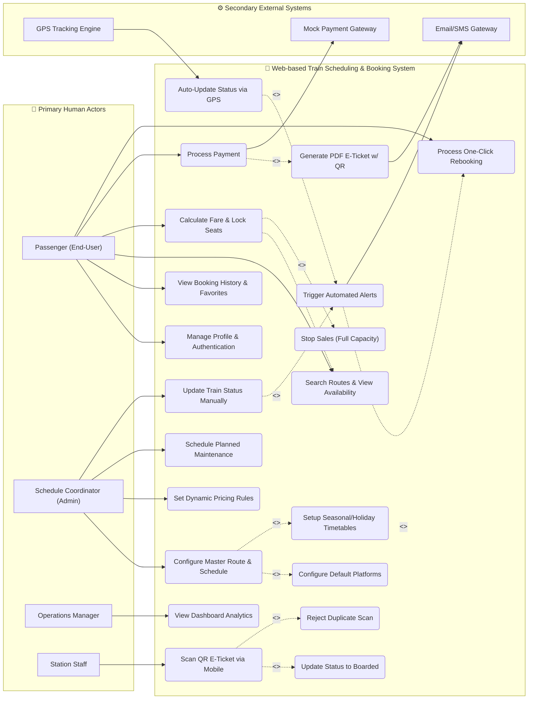
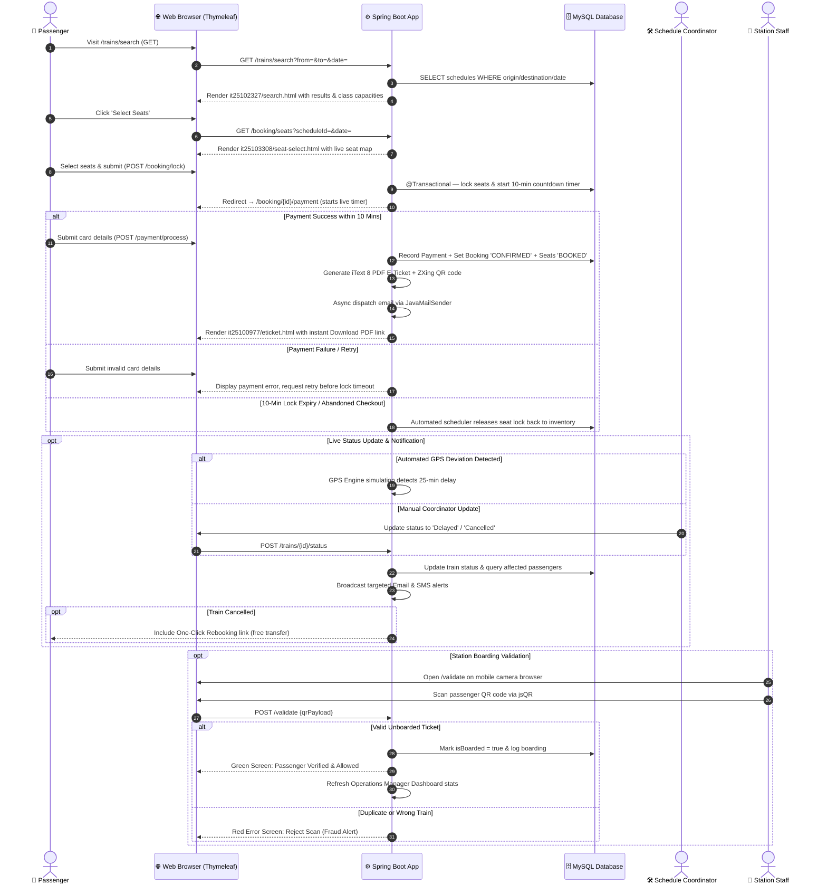
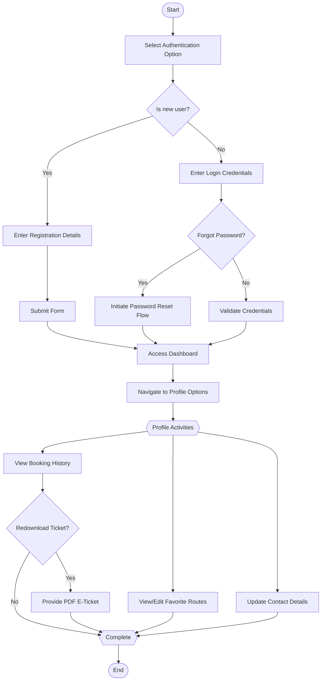
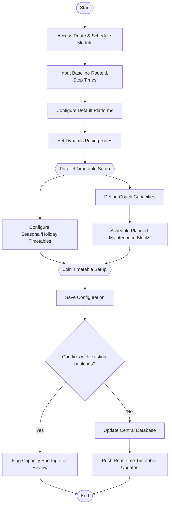
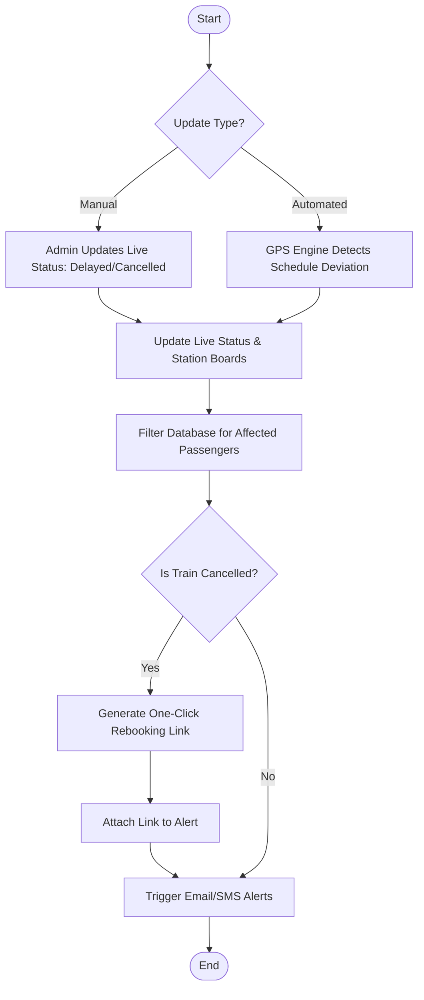
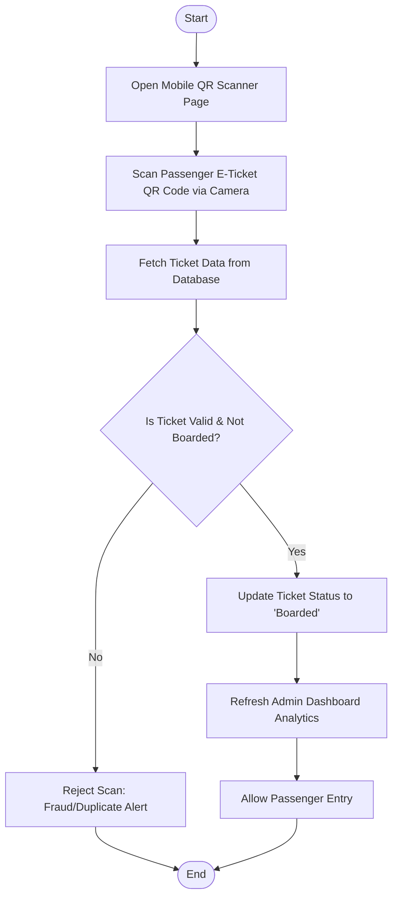

# 🚂 Web-based Train Scheduling & Booking System

[](https://github.com)
[](https://openjdk.org/projects/jdk/17/)
[](https://spring.io/projects/spring-boot)
[](https://www.mysql.com/)
[](https://opensource.org/licenses/MIT)
[](https://github.com)

---

> **SE2030 — Software Engineering | Year 2, Semester 1 — 2026**  
> **Group: 2026-Y2-S1-MLB-B9G2-10 | Sri Lanka Institute of Information Technology (SLIIT)**  
> A full-stack monolithic Java web application built with **Spring Boot 3**, **Thymeleaf**, and **MySQL** — delivering real-time seat reservation, atomic 10-minute temporary seat locking, automated GPS delay simulation, multi-channel passenger alerts (Email & SMS), one-click cancellation rebooking, QR-based digital ticketing with duplicate-scan fraud prevention, and centralized administrative dashboards.

---

## 📑 Table of Contents

- [Overview](#-overview)
- [Objectives & Goals](#-objectives--goals)
- [Key Features](#-key-features)
- [System Architecture](#-system-architecture)
- [Tech Stack](#-tech-stack)
- [UI & Application Gallery](#-ui--application-gallery)
- [System Use Case Model](#-system-use-case-model)
- [Workflow & Process Lifecycle](#-workflow--process-lifecycle)
- [Six Major Functions & Team Assignments](#-six-major-functions--team-assignments)
  - [UC-01: Passenger Profile & Account Management (IT25101520)](#function-1-passenger-profile--account-management-it25101520)
  - [UC-02: Train Route & Schedule Management (IT25102327)](#function-2-train-route--schedule-management-it25102327)
  - [UC-03: Real-Time Seat Reservation & Capacity Engine (IT25103308)](#function-3-real-time-seat-reservation--capacity-engine-it25103308)
  - [UC-04: Payment Processing & E-Ticket Generation (IT25100977)](#function-4-payment-processing--e-ticket-generation-it25100977)
  - [UC-05: Live Status & Automated Notification System (IT25102925)](#function-5-live-status--automated-notification-system-it25102925)
  - [UC-06: Admin Dashboard & Station Ticket Validation (IT25100228)](#function-6-admin-dashboard--station-ticket-validation-it25100228)
- [Minor / Utility Functions](#-minor--utility-functions)
- [Stakeholders & User Roles](#-stakeholders--user-roles)
- [Role-Based Access Control (RBAC)](#-role-based-access-control-rbac)
- [Non-Functional Requirements](#-non-functional-requirements)
- [Project Structure (Organized by Student ID)](#-project-structure)
- [Getting Started](#-getting-started)
  - [Prerequisites](#prerequisites)
  - [Database Setup](#database-setup)
  - [Configuration](#configuration)
  - [Running the Application](#running-the-application)
- [API Documentation](#-api-documentation)
- [Project Timeline & Milestones](#-project-timeline--milestones)
- [Testing & Quality Assurance](#-testing--quality-assurance)
- [System Constraints & Assumptions](#-system-constraints--assumptions)
- [Contributing & Branching Guidelines](#-contributing)
- [License & Acknowledgments](#-license--acknowledgments)

---

## 🔬 Overview

The **Web-based Train Scheduling & Booking System** is a modernized platform designed to replace slow, error-prone manual railway operations. Built as a **monolithic Spring Boot application**, it delivers both the backend business logic and the server-rendered UI via **Thymeleaf templates** — all from a single deployable root Maven project.

The platform provides **passengers** with a seamless experience to search timetables, reserve and lock seats in real time, process secure payments, receive digital E-Tickets with QR codes, and manage their trips online. **Railway management and operations** gain centralized oversight to configure master routes, platforms, seasonal timetables, and dynamic pricing, track revenues and delays, auto-detect GPS deviations, broadcast multi-channel alerts, and validate physical passenger boarding via mobile QR scanning.

```
                    +------------------------------------------------------+
                    |   Web-based Train Scheduling & Booking System         |
                    |       (Unified Spring Boot Monolith Project)          |
                    +------------------------------------------------------+
                                             |
         +------------------+----------------+----------------+------------------+
         |                  |                                 |                  |
   +-----+------+    +------+--------+              +--------+--------+   +-----+------+
   | Passenger  |    | Reservation   |              | Admin Dashboard |   | Notification|
   | UI Pages   |    | & E-Ticketing |              | & QR Validation |   | & GPS Engine|
   | (Thymeleaf)|    | Engine        |              | (Thymeleaf)     |   | (Mail & SMS)|
   +------------+    +---------------+              +-----------------+   +-------------+
```

---

## 🎯 Objectives & Goals

| # | Objective | Description |
|:-:|:----------|:------------|
| 1 | **Centralized Operations** | Real-time dashboards for management to track daily revenues, active schedules, boarding traffic, and delays. |
| 2 | **Prevent Overbooking** | Atomic seat inventory locking via `@Transactional` with a **10-minute temporary seat lock timer** to synchronize bookings with physical train capacities. |
| 3 | **Automated Delay & GPS Detection** | Dual-trigger status engine (Manual Coordinator update or Automated GPS Tracking Simulation) auto-updating departure boards and alerting passengers. |
| 4 | **Multi-Channel Alerts & Rebooking** | Instant Email and SMS notifications when trains are delayed or cancelled, featuring a **One-Click Rebooking link** for instant transfer without re-payment. |
| 5 | **Digital Ticket Verification & Anti-Fraud** | Encrypted QR-code enabled PDF E-Tickets for fast mobile web scanning by station staff, rejecting duplicate scans with red error screens to eliminate fraud. |
| 6 | **Dynamic Operational Flexibility** | Administrative tools for platform allocations, dynamic pricing rules, seasonal/holiday overrides, and maintenance block tracking. |

---

## ⚡ Key Features

* 🔐 **Secure Authentication & Account Management:** Spring Security form-login with BCrypt password hashing, session management, unique email validation, automatic login upon registration, and self-service password reset.
* 🔍 **Intelligent Route & Schedule Search:** Filter by origin, destination, date, and seat class with real-time capacity querying.
* 💺 **Real-Time Seat Reservation & 10-Minute Lock Timer:** `@Transactional` atomic operations temporarily lock selected seats for 10 minutes to prevent double-booking; auto-releases inventory if checkout is abandoned or times out.
* 🛑 **Automated Stop-Sales Prevention:** Automatically halts sales for specific train classes when capacity is 100% full.
* 🛤️ **Master Train & Timetable CRUD:** Coordinators manage train fleets, stop times, intermediate stations, and coach capacities per class.
* 🚉 **Default Platform Allocation & Conflict Detection:** Configure default platforms per station; system checks for track and time collisions.
* 📈 **Dynamic Pricing Rules Engine:** Admin sets pricing rules based on distance tiers, seasonal demand, and seating classes.
* 🗓️ **Seasonal & Holiday Timetable Overrides:** Set up special holiday schedules that automatically override standard timetables for specific calendar dates.
* 🔧 **Planned Maintenance Blocks:** Define coach capacities and schedule maintenance blocks with automated capacity shortage detection and temporary booking suspension.
* 💳 **Mock Payment Gateway & Retry Workflow:** Simulated payment processing with graceful transaction failure prompts allowing retry before releasing seats.
* 🎟️ **PDF E-Ticket & Scannable QR Generation:** Auto-generates downloadable PDF E-Tickets (iText 8) with embedded cryptographic QR codes (ZXing); dual delivery via web download and automated email.
* 🛰️ **GPS Tracking Simulation & Auto-Delay Detection:** Continuous background GPS simulation detects train schedule deviations and automatically updates live statuses.
* 🔔 **Multi-Channel Targeted Alerts:** Automated Email (`JavaMailSender`) and SMS gateway dispatch alerting affected passengers with active bookings.
* 🔄 **One-Click Rebooking Integration:** If a train is cancelled, notification alerts include a one-click link transferring passengers to the next train with zero additional payment.
* 📊 **Executive Operational Dashboard:** Daily revenue KPIs, passenger volumes, and delay analytics via Thymeleaf and Chart.js.
* 📱 **Mobile Web QR Ticket Validation:** Station staff use device cameras via browser (`jsQR`) to validate E-Tickets, updating status to "Boarded" and rejecting duplicate scans with vivid red error screens.
* ⭐ **Favorite Routes & Quick Rebooking:** Passengers save frequent routes for one-click timetable lookups and repeat bookings.

---

## 🛠️ System Architecture

```
Browser (HTML5 / CSS3 / JavaScript / Camera API)
        │
        │  HTTP Requests (Form POSTs, GET links, REST JSON)
        ▼
┌────────────────────────────────────────────────────────────────┐
│                  Spring Boot Application                        │
│                   (Embedded Tomcat)                            │
│                                                                │
│  ┌─────────────────────────────────────────────────────────┐  │
│  │              Spring MVC Controller Layer                 │  │
│  │  @Controller (returns Thymeleaf view names)             │  │
│  │  @RestController (returns JSON for QR scanner & API)    │  │
│  └────────────────────┬────────────────────────────────────┘  │
│                       │                                        │
│  ┌────────────────────▼────────────────────────────────────┐  │
│  │              Service Layer (@Service)                    │  │
│  │  Business logic, 10-min seat locking, dynamic pricing   │  │
│  │  PDF generation, QR encoding, GPS delay simulation      │  │
│  │  Multi-channel notifications, QR validation engine      │  │
│  └────────────────────┬────────────────────────────────────┘  │
│                       │                                        │
│  ┌────────────────────▼────────────────────────────────────┐  │
│  │     Repository Layer (Spring Data JPA)                  │  │
│  │     JpaRepository → Hibernate ORM → MySQL               │  │
│  └─────────────────────────────────────────────────────────┘  │
│                                                                │
│  ┌──────────────────┐  ┌──────────────────────────────────┐   │
│  │ Spring Security  │  │     Thymeleaf Template Engine     │   │
│  │ (Auth / RBAC)    │  │  Renders HTML server-side         │   │
│  └──────────────────┘  └──────────────────────────────────┘   │
└────────────────────────────────────────────────────────────────┘
        │                          │
        ▼                          ▼
  ┌──────────┐              ┌──────────────┐
  │  MySQL   │              │  File System │
  │ Database │              │  (PDF/QR     │
  │          │              │   storage)   │
  └──────────┘              └──────────────┘
```

> [!NOTE]
> This is a **server-side rendered (SSR)** architecture. Thymeleaf processes `.html` templates on the server and sends complete HTML pages to the browser — no separate frontend build step required. The application builds and ships as a single self-contained JAR directly from the project root.

---

## 🛠️ Tech Stack

### Application Framework & Core


### UI / Templating & Client Scripting


### Database & ORM


### Build & Tooling


### Specialized Libraries
| Library | Version | Purpose |
|:---|:---|:---|
| **iText Core** | `8.0.4` | Server-side PDF E-Ticket generation with formatted tables and ticket graphics |
| **ZXing Core & JavaSE** | `3.5.3` | QR code generation embedding cryptographically signed ticket payloads |
| **Spring Boot Mail** | `3.2.5` | Transactional email delivery (`JavaMailSender`) with PDF ticket attachments |
| **JJWT** | `0.12.5` | Token generation and signature verification for security and QR payloads |
| **Chart.js** | CDN | Responsive revenue and passenger volume visualizations on admin dashboard |
| **jsQR** | CDN | High-performance HTML5 Canvas mobile web barcode/QR video stream scanner |

---

## 🖼️ UI & Application Gallery

| **Passenger Search & Booking** | **Admin Dashboard** |
| :---: | :---: |
|  |  |
| *Search trains by route, date, and class — see live availability.* | *Revenue KPIs, booking volumes, and train delay monitoring.* |

| **E-Ticket with QR Code** | **QR Ticket Validation** |
| :---: | :---: |
|  |  |
| *PDF downloadable ticket with encrypted QR code.* | *Mobile web QR scanner for station staff boarding validation.* |

---

## 🗺️ System Use Case Model

The System Use Case Diagram consolidates all six major functional modules into a single unified architecture, mapping the interactions between the 4 primary human actors, 3 secondary external systems, and 18 core use cases:



---

## 🔄 Workflow & Process Lifecycle



---

## 👥 Six Major Functions & Team Assignments

---

### Function 1: Passenger Profile & Account Management (IT25101520)

| Attribute | Detail |
|:---|:---|
| **Assigned To** | **Dukshanth K.** (IT25101520) |
| **Target User** | Passenger (End-User) |
| **Java Package** | `com.trainbooking.it25101520.*` |
| **Layer Structure** | `controller/`, `service/`, `model/`, `repository/`, `dto/` |
| **UI Templates** | `src/main/resources/templates/it25101520/` |

#### Use Case Scenario (UC-01)
| Field | Description |
|:---|:---|
| **Number** | UC-01 |
| **Name** | Passenger Profile & Account Management |
| **Summary** | The passenger manages their authentication, updates personal details, and accesses past booking history. |
| **Priority** | 4 |
| **Preconditions** | The passenger has navigated to the system's web portal. |
| **Postconditions** | The passenger's profile is created/updated, or their past E-Tickets are retrieved. |
| **Primary Actor(s)** | Passenger (End-User) |
| **Secondary Actor(s)** | None |
| **Trigger** | The passenger chooses to register, log in, or access their profile. |
| **Main Scenario** | 1. Passenger selects the registration or login option.<br/>2. System prompts for credentials.<br/>3. Passenger provides details and accesses the dashboard.<br/>4. Passenger navigates to booking history or favorite routes.<br/>5. System displays saved contact details, favorite routes, or past E-Tickets. |
| **Extensions** | **1a.** Passenger forgets password; system initiates the password reset flow.<br/>**5a.** Passenger opts to redownload a past E-Ticket; system provides the PDF. |
| **Open Issues** | None |

#### Activity Diagram (Worksheet 04)


---

### Function 2: Train Route & Schedule Management (IT25102327)

| Attribute | Detail |
|:---|:---|
| **Assigned To** | **Balawickrama B.R.D.** (IT25102327) |
| **Target User** | Schedule Coordinator (Admin) |
| **Java Package** | `com.trainbooking.it25102327.*` |
| **Layer Structure** | `controller/`, `service/`, `model/`, `repository/`, `dto/` |
| **UI Templates** | `src/main/resources/templates/it25102327/` |

#### Use Case Scenario (UC-02)
| Field | Description |
|:---|:---|
| **Number** | UC-02 |
| **Name** | Train Route & Schedule Management |
| **Summary** | Admin configures master schedules including seasonal variations, pricing rules, platforms, and maintenance blocks. |
| **Priority** | 5 |
| **Preconditions** | The Schedule Coordinator is logged into the admin dashboard. |
| **Postconditions** | Master timetable, dynamic pricing, and coach capacity are updated globally. |
| **Primary Actor(s)** | Schedule Coordinator (Admin) |
| **Secondary Actor(s)** | None |
| **Trigger** | Admin needs to configure or update the master train network plan. |
| **Main Scenario** | 1. Admin accesses the Route & Schedule Module.<br/>2. Admin inputs baseline route details, standard stop times, and default platform allocations.<br/>3. Admin configures dynamic pricing rules for the route.<br/>4. Admin sets up Seasonal & Holiday Timetables to automatically override standard schedules on specific dates.<br/>5. Admin defines physical coach capacities and schedules Planned Maintenance Blocks.<br/>6. System saves the configuration and updates the central database. |
| **Extensions** | **5a.** A maintenance block conflicts with existing bookings; system flags the capacity shortage for review.<br/>**6a.** Admin modifies an active schedule; system temporarily suspends bookings for affected dates. |
| **Open Issues** | How far in advance should seasonal timetables be locked to prevent passenger confusion? |

#### Activity Diagram (Worksheet 04)


---

### Function 3: Real-Time Seat Reservation & Capacity Engine (IT25103308)

| Attribute | Detail |
|:---|:---|
| **Assigned To** | **Anfas M.S.** (IT25103308) |
| **Target User** | Passenger (End-User) |
| **Java Package** | `com.trainbooking.it25103308.*` |
| **Layer Structure** | `controller/`, `service/`, `model/`, `repository/`, `dto/` |
| **UI Templates** | `src/main/resources/templates/it25103308/` |

#### Use Case Scenario (UC-03)
| Field | Description |
|:---|:---|
| **Number** | UC-03 |
| **Name** | Real-Time Seat Reservation & Capacity Engine |
| **Summary** | Passenger searches for routes, views availability, and locks seats. |
| **Priority** | 5 |
| **Preconditions** | Passenger is logged in; Schedule Coordinator has configured the routes. |
| **Postconditions** | Selected seats are locked temporarily for checkout to prevent overbooking. |
| **Primary Actor(s)** | Passenger (End-User) |
| **Secondary Actor(s)** | None |
| **Trigger** | Passenger selects a travel date and route. |
| **Main Scenario** | 1. System displays available routes and seat capacity per class.<br/>2. Passenger selects desired train, class, and seats.<br/>3. System dynamically calculates the ticket fare.<br/>4. System temporarily locks the selected seats and proceeds to checkout. |
| **Extensions** | **1a.** System notifies user that full capacity is reached and stops sales.<br/>**4a.** Passenger abandons checkout; system releases locked seats. |
| **Open Issues** | How long should the temporary seat lock last before timing out? *(Resolved: Standard 10-minute temporary seat lock timer with auto-release)* |

#### Activity Diagram (Worksheet 04)
```mermaid
flowchart TD
    Start([Start]) --> EnterSearch[Enter Route & Travel Date]
    EnterSearch --> SearchAvail[Search Availability]
    SearchAvail --> CapacityCheck{"Is Capacity Full?"}
    
    CapacityCheck -- Yes --> NotifyFull[Notify Full Capacity]
    NotifyFull --> StopSales[Stop Sales]
    StopSales --> EndNode([End])
    
    CapacityCheck -- No --> DisplayTrains[Display Available Trains & Classes]
    DisplayTrains --> SelectSeats[Select Train, Class, and Seats]
    SelectSeats --> CalcFare[Calculate Ticket Fare Dynamically]
    CalcFare --> LockSeats[Lock Seats Temporarily (10-Min Lock)]
    LockSeats --> ProceedCheckout[Proceed to Checkout]
    ProceedCheckout --> EndNode
```

---

### Function 4: Payment Processing & E-Ticket Generation (IT25100977)

| Attribute | Detail |
|:---|:---|
| **Assigned To** | **Shehara D.M.D.** (IT25100977) |
| **Target User** | Passenger (End-User) |
| **Secondary Actors**| Payment Gateway (Mock), Email Gateway |
| **Java Package** | `com.trainbooking.it25100977.*` |
| **Layer Structure** | `controller/`, `service/`, `model/`, `repository/`, `dto/` |
| **UI Templates** | `src/main/resources/templates/it25100977/` |

#### Use Case Scenario (UC-04)
| Field | Description |
|:---|:---|
| **Number** | UC-04 |
| **Name** | Payment Processing & E-Ticket Generation |
| **Summary** | The system processes payment securely and generates a scannable PDF E-Ticket. |
| **Priority** | 5 |
| **Preconditions** | Passenger has selected and locked their seats in the reservation engine. |
| **Postconditions** | Payment is processed, and an E-Ticket is generated and emailed. |
| **Primary Actor(s)** | Passenger (End-User) |
| **Secondary Actor(s)**| Payment Gateway (Mock), Email Gateway |
| **Trigger** | Passenger confirms booking and initiates payment at checkout. |
| **Main Scenario** | 1. Passenger inputs payment details into the mock payment gateway form.<br/>2. System processes the transaction securely.<br/>3. System generates a downloadable PDF E-Ticket containing booking details and an embedded unique QR code.<br/>4. System automatically sends the E-Ticket via the email gateway to the passenger. |
| **Extensions** | **2a.** Payment transaction fails; system informs the passenger and requests a retry before releasing locked seats. |
| **Open Issues** | None |

#### Activity Diagram (Worksheet 04)
```mermaid
flowchart TD
    Start([Start]) --> InputPayment[Input Payment Details]
    InputPayment --> ProcessTrans[Process Transaction via Mock Gateway]
    ProcessTrans --> SuccessCheck{"Transaction Successful?"}
    
    SuccessCheck -- No --> DisplayErr[Display Error Message]
    DisplayErr --> ReleaseSeats[Release Locked Seats]
    ReleaseSeats --> EndNode([End])
    
    SuccessCheck -- Yes --> StoreDB[Store Booking & Payment in DB]
    StoreDB --> ForkTicket{{"Generate E-Ticket Assets"}}
    
    ForkTicket --> GenPDF[Generate PDF E-Ticket (iText 8)]
    ForkTicket --> EmbedQR[Embed Unique QR Code (ZXing)]
    
    GenPDF --> JoinTicket{{"Ticket Ready"}}
    EmbedQR --> JoinTicket
    
    JoinTicket --> EmailPass[Email E-Ticket to Passenger (JavaMail)]
    EmailPass --> ProvideLink[Provide Downloadable Ticket Link]
    ProvideLink --> EndNode
```

---

### Function 5: Live Status & Automated Notification System (IT25102925)

| Attribute | Detail |
|:---|:---|
| **Assigned To** | **Sovis W.M.A.V.** (IT25102925) |
| **Target User** | Schedule Coordinator (Admin) & Passenger |
| **Secondary Actors**| GPS Tracking Engine, Email/SMS Gateway |
| **Java Package** | `com.trainbooking.it25102925.*` |
| **Layer Structure** | `controller/`, `service/`, `model/`, `repository/`, `dto/` |
| **UI Templates** | `src/main/resources/templates/it25102925/` |

#### Use Case Scenario (UC-05)
| Field | Description |
|:---|:---|
| **Number** | UC-05 |
| **Name** | Live Status & Automated Notification System |
| **Summary** | System tracks live GPS data, updates statuses automatically, alerts passengers, and offers instant rebooking. |
| **Priority** | 4 |
| **Preconditions** | Trains are active on the route; passengers have active bookings. |
| **Postconditions** | Live status is updated globally, alerts are sent, and rebooking options are provided. |
| **Primary Actor(s)** | Schedule Coordinator (Admin), GPS Tracking Engine |
| **Secondary Actor(s)**| Passenger (End-User), Email/SMS Gateway |
| **Trigger** | Automated GPS tracking detects a delay, or Admin manually cancels a train. |
| **Main Scenario** | 1. Automated GPS Tracking Simulation continuously monitors train positions and detects a schedule deviation.<br/>2. System auto-updates the live status and station departure boards.<br/>3. System filters the central database for affected passengers.<br/>4. System triggers targeted Email/SMS alerts regarding the delay. |
| **Extensions** | **1a.** Admin manually updates status to "Cancelled".<br/>**4a.** For cancellations, the system's notification includes a One-Click Rebooking Integration link.<br/>**4b.** Passenger clicks the rebooking link and is instantly transferred to the next available train without additional payment processing. |
| **Open Issues** | What is the maximum acceptable latency for the GPS Tracking Simulation to ensure accurate alerts? |

#### Activity Diagram (Worksheet 04)


---

### Function 6: Admin Dashboard & Station Ticket Validation (IT25100228)

| Attribute | Detail |
|:---|:---|
| **Assigned To** | **Mahanama M.N.S.T.** (IT25100228) |
| **Target User** | Operations Manager & Station Staff |
| **Secondary Actor** | Passenger (End-User) |
| **Java Package** | `com.trainbooking.it25100228.*` |
| **Layer Structure** | `controller/`, `service/`, `dto/` |
| **UI Templates** | `src/main/resources/templates/it25100228/` |

#### Use Case Scenario (UC-06)
| Field | Description |
|:---|:---|
| **Number** | UC-06 |
| **Name** | Admin Dashboard & Station Ticket Validation |
| **Summary** | Managers track daily metrics while station staff validate passenger E-Tickets using mobile QR scanners. |
| **Priority** | 5 |
| **Preconditions** | Station Staff are logged into the mobile scanner page. Passenger presents a QR E-Ticket. |
| **Postconditions** | Ticket status is updated to "Boarded" and dashboard metrics are refreshed. |
| **Primary Actor(s)** | Station Staff, Operations Manager |
| **Secondary Actor(s)**| Passenger (End-User) |
| **Trigger** | A passenger presents an E-Ticket for station entry/boarding. |
| **Main Scenario** | 1. Station Staff scans the passenger's E-Ticket QR code using the mobile scanner page.<br/>2. System verifies the ticket data against the central database.<br/>3. System instantly updates the ticket status to "Boarded" to prevent duplicate entry.<br/>4. System feeds this real-time data into the high-level dashboard analytics for the Operations Manager. |
| **Extensions** | **2a.** Station Staff scans a ticket that is already marked as "Boarded"; system rejects the scan to prevent fraud.<br/>**2b.** Scanner loses internet connection; validation fails as stable internet is assumed as a system limitation. |
| **Open Issues** | None |

#### Activity Diagram (Worksheet 04)


---

## 🔧 Minor / Utility Functions

| Utility | Description |
|:---|:---|
| **Authentication Utility** | Spring Security form login, BCrypt password hashing, session management, logout, and token helpers. |
| **User Profile Utilities** | Contact detail editing, password reset link tokens, and favorite route management. |
| **Booking Utilities** | Route search query filters, 10-minute temporary seat countdown, and booking history retrieval. |
| **Notification Utilities** | Transactional email confirmation triggers, automated GPS delay simulation, SMS gateway payload builders. |
| **Administrative Utilities** | Real-time KPI summaries, dynamic platform allocation validator, and embedded HTML5 QR scanner. |

---

## 🎭 Stakeholders & User Roles

| Role | Type | Spring Security Role | Primary Responsibilities |
|:---|:---|:---|:---|
| **Passenger** | External | `ROLE_PASSENGER` | Search trains, lock seats, pay, download E-Tickets, rebook, manage favorite routes and profile. |
| **Schedule Coordinator** | Internal | `ROLE_COORDINATOR` | Configure master routes, intermediate stop times, platforms, seasonal overrides, dynamic pricing, and maintenance blocks. |
| **Operations Manager** | Internal | `ROLE_ADMIN` | Executive KPI dashboard, revenue analytics, station boarding throughput monitoring. |
| **Station Staff** | Internal | `ROLE_STATION_STAFF` | Mobile web camera QR scanning, platform boarding validation, duplicate/fraud rejection. |

---

## 🛡️ Role-Based Access Control (RBAC)

Spring Security `HttpSecurity` enforces strict route-level authorization:

```
+------------------------------------+-------------+--------------------+--------------------+------------------+
| URL Pattern                        | PASSENGER   | COORDINATOR        | ADMIN              | STATION_STAFF    |
+------------------------------------+-------------+--------------------+--------------------+------------------+
| GET /trains/search                 |     ✅      |         ✅         |         ✅         |       ✅         |
| POST /booking/lock                 |     ✅      |         ❌         |         ❌         |       ❌         |
| GET /passenger/booking-history     |  ✅ (own)   |         ❌         |         ❌         |       ❌         |
| GET/POST /payment/**               |     ✅      |         ❌         |         ❌         |       ❌         |
| GET/POST /trains/manage            |     ❌      |         ✅         |         ✅         |       ❌         |
| POST /trains/{id}/status           |     ❌      |         ✅         |         ✅         |       ❌         |
| POST /schedules/seasonal/**        |     ❌      |         ✅         |         ✅         |       ❌         |
| POST /schedules/maintenance/**     |     ❌      |         ✅         |         ✅         |       ❌         |
| GET /dashboard/**                  |     ❌      |         ❌         |         ✅         |       ❌         |
| GET/POST /validate                 |     ❌      |         ❌         |         ❌         |       ✅         |
| GET /rebooking/claim/**            |     ✅      |         ❌         |         ❌         |       ❌         |
| /swagger-ui/**                     |     ✅      |         ✅         |         ✅         |       ✅         |
+------------------------------------+-------------+--------------------+--------------------+------------------+
```

---

## 📐 Non-Functional Requirements

| Quality Attribute | Implementation Approach |
|:---|:---|
| **Performance** | Spring Data JPA with indexed database queries; `@Transactional` isolation for atomic seat locking. |
| **Security** | Spring Security BCrypt passwords; CSRF protection; role-based URL authorization; cryptographically signed QR payloads. |
| **Reliability** | Hibernate `ddl-auto=update`; automatic database rollback on failed checkout; scheduled zombie-lock release worker. |
| **Usability** | Thymeleaf server-side rendered pages with responsive vanilla CSS — works seamlessly on desktop and mobile. |
| **Availability** | Embedded Tomcat container; zero external runtime dependencies beyond JDK 17 and MySQL 8.0. |
| **Scalability** | Clean modular architecture partitioned by Student ID packages; ready for containerized Docker deployment. |

---

## 📁 Project Structure

The project is structured as a **single root-level Spring Boot Maven project**. All development work is organized inside clean, dedicated folders by **Student ID numbers**:

```
project/
├── pom.xml                                      ← Maven dependencies & build configuration (Java 17)
├── README.md                                    ← Master project documentation
├── plan.md                                      ← Comprehensive engineering roadmap
├── 2026-Y2-S1-MLB-B9G2-10_lab03.pdf             ← Worksheet 03: Use Case Diagrams & Specs
├── 2026-Y2-S1-MLB-B9G2-10_Activity.pdf          ← Worksheet 04: Activity Diagrams & Specs
│
└── src/
    ├── main/
    │   ├── java/com/trainbooking/
    │   │   ├── TrainBookingApplication.java     ← Main entry point (@SpringBootApplication)
    │   │   │
    │   │   ├── config/                          ← SecurityConfig, WebMvcConfig, OpenApiConfig
    │   │   ├── security/                        ← JwtUtil, UserDetailsServiceImpl
    │   │   ├── exception/                       ← GlobalExceptionHandler, ApiException
    │   │   │
    │   │   ├── it25101520/                      ← 👤 IT25101520: Dukshanth K. (UC-01)
    │   │   │   ├── controller/                  (AuthController, PassengerController)
    │   │   │   ├── service/                     (AuthService, PassengerService)
    │   │   │   ├── model/                       (User, FavoriteRoute)
    │   │   │   ├── repository/                  (UserRepository, FavoriteRouteRepository)
    │   │   │   └── dto/                         (LoginRequest, RegisterRequest, UserProfileDto, etc.)
    │   │   │
    │   │   ├── it25102327/                      ← 👤 IT25102327: Balawickrama B.R.D. (UC-02)
    │   │   │   ├── controller/                  (TrainController, ScheduleController)
    │   │   │   ├── service/                     (TrainService, ScheduleService)
    │   │   │   ├── model/                       (Train, Route, Schedule)
    │   │   │   ├── repository/                  (TrainRepository, RouteRepository, ScheduleRepository)
    │   │   │   └── dto/                         (TrainDto, RouteDto, ScheduleDto, etc.)
    │   │   │
    │   │   ├── it25103308/                      ← 👤 IT25103308: Anfas M.S. (UC-03)
    │   │   │   ├── controller/                  (BookingController)
    │   │   │   ├── service/                     (BookingService)
    │   │   │   ├── model/                       (Booking)
    │   │   │   ├── repository/                  (BookingRepository)
    │   │   │   └── dto/                         (BookingRequest, BookingResponseDto)
    │   │   │
    │   │   ├── it25100977/                      ← 👤 IT25100977: Shehara D.M.D. (UC-04)
    │   │   │   ├── controller/                  (PaymentController)
    │   │   │   ├── service/                     (PaymentService)
    │   │   │   ├── model/                       (Payment, Ticket)
    │   │   │   ├── repository/                  (PaymentRepository, TicketRepository)
    │   │   │   └── dto/                         (PaymentRequest)
    │   │   │
    │   │   ├── it25102925/                      ← 👤 IT25102925: Sovis W.M.A.V. (UC-05)
    │   │   │   ├── controller/                  (NotificationController)
    │   │   │   ├── service/                     (NotificationService, EmailService)
    │   │   │   ├── model/                       (Notification)
    │   │   │   ├── repository/                  (NotificationRepository)
    │   │   │   └── dto/                         (NotificationDto)
    │   │   │
    │   │   └── it25100228/                      ← 👤 IT25100228: Mahanama M.N.S.T. (UC-06)
    │   │       ├── controller/                  (DashboardController, TicketValidationController)
    │   │       ├── service/                     (DashboardService, TicketValidationService)
    │   │       └── dto/                         (DashboardStatsDto, ValidationResultDto)
    │   │
    │   └── resources/
    │       ├── application.properties           ← Database, JPA, Mail, and JWT properties
    │       ├── application-dev.properties       ← Local development profile
    │       ├── static/                          ← Static assets (CSS, JS, Images)
    │       │   ├── css/                         (variables.css, global.css)
    │       │   ├── js/                          (main.js, qr-scanner.js)
    │       │   └── images/
    │       │
    │       └── templates/                       ← 🎨 Server-rendered Thymeleaf HTML Views
    │           ├── it25101520/                  (login.html, register.html, forgot-password.html, profile.html)
    │           ├── it25102327/                  (manage.html, search.html)
    │           ├── it25103308/                  (seat-select.html)
    │           ├── it25100977/                  (payment.html, eticket.html)
    │           ├── it25102925/                  (list.html, status.html)
    │           ├── it25100228/                  (index.html, validate.html)
    │           ├── layout/                      (base.html, admin-base.html)
    │           └── error/                       (404.html, 500.html)
    │
    └── test/java/com/trainbooking/              ← 🧪 Unit & Integration Tests by Student ID
        ├── it25101520/
        ├── it25102327/
        ├── it25103308/
        ├── it25100977/
        ├── it25102925/
        └── it25100228/
```

> [!TIP]
> **For team members:** Each developer works directly inside their assigned `com.trainbooking.<student_id>` Java package and matching `templates/<student_id>/` view directory. This compartmentalization prevents merge collisions and ensures seamless parallel development.

---

## 🚀 Getting Started

### Prerequisites

Ensure the following tools are installed and configured on your system:

| Tool | Version | Verification Command |
|:---|:---|:---|
| **Java JDK** | 17 LTS or higher | `java -version` |
| **Apache Maven** | 3.8+ | `mvn -version` |
| **MySQL** | 8.0+ (via XAMPP or standalone) | Start via XAMPP Control Panel |
| **Git** | Latest | `git --version` |

---

### Database Setup

1. **Start MySQL** via the XAMPP Control Panel (click **Start** next to MySQL).
2. Open phpMyAdmin at `http://localhost/phpmyadmin` OR use the MySQL CLI:
   ```sql
   mysql -u root -p
   CREATE DATABASE train_booking_db;
   ```
3. **Automatic Schema Generation:** Spring Boot will automatically create all tables and relationships on initial run via `spring.jpa.hibernate.ddl-auto=update`.

---

### Configuration

The default `application.properties` is pre-configured for standard local development (root user, no password):

```
src/main/resources/application.properties
```

Key configuration properties:

```properties
# Database Connectivity
spring.datasource.url=jdbc:mysql://localhost:3306/train_booking_db?createDatabaseIfNotExist=true&useSSL=false&serverTimezone=UTC
spring.datasource.username=root
spring.datasource.password=

# Hibernate & JPA
spring.jpa.hibernate.ddl-auto=update
spring.jpa.show-sql=true

# JWT Token Secret
app.jwt.secret=your-super-secret-256-bit-encryption-key-for-sliit-project

# Mail Gateway (Mailtrap for dev / SMTP for production)
spring.mail.host=smtp.mailtrap.io
spring.mail.port=2525
spring.mail.username=your_username
spring.mail.password=your_password
```

---

### Running the Application

Run directly from the root project directory:

```bash
# Compile and start the Spring Boot application
mvn spring-boot:run
```

The application starts on **`http://localhost:8080`**.

| URL | View / Purpose | Access |
|:---|:---|:---|
| `http://localhost:8080` | Passenger Train Search & Timetable page | Public |
| `http://localhost:8080/login` | Passenger & Staff Login page | Public |
| `http://localhost:8080/register` | New Passenger Registration page | Public |
| `http://localhost:8080/dashboard` | Executive Management Dashboard | `ROLE_ADMIN` |
| `http://localhost:8080/trains/manage` | Train, Route, & Schedule Management | `ROLE_COORDINATOR`, `ROLE_ADMIN` |
| `http://localhost:8080/validate` | Mobile Web Camera QR Ticket Scanner | `ROLE_STATION_STAFF` |
| `http://localhost:8080/swagger-ui.html` | Interactive REST API Documentation | Public |
| `http://localhost:8080/api/health` | Server Health Check JSON | Public |

#### Building a Standalone Deployable JAR

```bash
mvn clean package
java -jar target/train-booking-system-1.0.0.jar
```

---

## 📡 API Documentation

Interactive Swagger OpenAPI documentation is accessible at `http://localhost:8080/swagger-ui.html`.

### Authentication & Account (`it25101520`)
| Method | URL | Description | Access |
|:---|:---|:---|:---|
| `GET` | `/login` | Render login view | Public |
| `POST` | `/login` | Authenticate credentials (form submit) | Public |
| `GET` | `/register` | Render registration view | Public |
| `POST` | `/register` | Create account & auto-login | Public |
| `GET` | `/passenger/profile` | View passenger personal profile | `ROLE_PASSENGER` |
| `POST` | `/passenger/profile` | Update contact information | `ROLE_PASSENGER` |
| `GET` | `/passenger/favorites` | View saved favorite routes | `ROLE_PASSENGER` |
| `POST` | `/logout` | Invalidate session & logout | Authenticated |

### Train Fleet & Timetable Operations (`it25102327`)
| Method | URL | Description | Access |
|:---|:---|:---|:---|
| `GET` | `/trains/search` | Search trains by route & date | Public |
| `GET` | `/trains/manage` | Master train & route manager view | `COORDINATOR` / `ADMIN` |
| `POST` | `/trains` | Create new train set | `COORDINATOR` / `ADMIN` |
| `POST` | `/trains/{id}` | Update train capacities & layout | `COORDINATOR` / `ADMIN` |
| `POST` | `/trains/{id}/delete` | Delete train | `COORDINATOR` / `ADMIN` |
| `POST` | `/schedules/seasonal` | Configure seasonal timetable override | `COORDINATOR` / `ADMIN` |
| `POST` | `/schedules/maintenance` | Schedule planned maintenance block | `COORDINATOR` / `ADMIN` |

### Seat Reservation & Capacity Engine (`it25103308`)
| Method | URL | Description | Access |
|:---|:---|:---|:---|
| `GET` | `/booking/seats` | Interactive seat selection map | `ROLE_PASSENGER` |
| `POST` | `/booking/lock` | Atomically lock selected seats (10 mins) | `ROLE_PASSENGER` |
| `POST` | `/booking/release` | Explicitly release locked seats | `ROLE_PASSENGER` |

### Payment & E-Ticketing (`it25100977`)
| Method | URL | Description | Access |
|:---|:---|:---|:---|
| `GET` | `/payment/checkout/{id}` | Render mock payment form | `ROLE_PASSENGER` |
| `POST` | `/payment/process` | Process mock payment transaction | `ROLE_PASSENGER` |
| `GET` | `/payment/ticket/{id}` | View generated E-Ticket with QR | `ROLE_PASSENGER` |
| `GET` | `/payment/ticket/{id}/download`| Download PDF E-Ticket (iText 8) | `ROLE_PASSENGER` |

### Notifications & GPS Status Engine (`it25102925`)
| Method | URL | Description | Access |
|:---|:---|:---|:---|
| `POST` | `/trains/{id}/status` | Manually update operational train status | `COORDINATOR` / `ADMIN` |
| `GET` | `/departure-board` | Live public station departure board | Public |
| `GET` | `/rebooking/claim/{token}`| One-Click cancellation rebooking claim | `ROLE_PASSENGER` |

### Executive Dashboard & Boarding Validation (`it25100228`)
| Method | URL | Description | Access |
|:---|:---|:---|:---|
| `GET` | `/dashboard` | Operations Manager KPI dashboard | `ROLE_ADMIN` |
| `GET` | `/dashboard/revenue` | Revenue metrics breakdown (JSON) | `ROLE_ADMIN` |
| `GET` | `/validate` | Mobile web camera QR scanner view | `ROLE_STATION_STAFF` |
| `POST` | `/validate` | Validate QR ticket & mark boarded | `ROLE_STATION_STAFF` |

---

## 📅 Project Timeline & Milestones

The project development lifecycle spans 14 academic weeks aligned with the SLIIT SE2030 software engineering curriculum:

```mermaid
gantt
    title SLIIT SE2030 Project Development Schedule — 14 Weeks
    dateFormat  YYYY-MM-DD
    axisFormat  Week %W

    section Phase 0: System Specification
    SRS, Scope & Architecture Baseline     :done, p0_1, 2026-01-19, 1w
    Worksheet 03: Use Case Diagrams & Specs:done, p0_2, after p0_1, 1w
    Worksheet 04: Activity Diagrams        :done, p0_3, after p0_2, 1w

    section Phase 1: Core Domain Implementation
    UC-01 Auth & Passenger Profile (IT25101520) :active, p1_1, after p0_3, 2w
    UC-02 Master Trains & Timetables (IT25102327):active, p1_2, after p0_3, 2w

    section Phase 2: Booking & Payment Engines
    UC-03 10-Min Seat Lock Engine (IT25103308)  :p2_1, after p1_1, 2w
    UC-04 Payment & PDF E-Ticket (IT25100977)    :p2_2, after p1_2, 2w

    section Phase 3: Operational Intelligence
    UC-05 GPS Simulation & Alerts (IT25102925)   :p3_1, after p2_1, 2w
    UC-06 QR Scanner & Dashboard (IT25100228)    :p3_2, after p2_2, 2w

    section Phase 4: Verification & Delivery
    System Integration & Concurrency Testing     :p4_1, after p3_1, 1w
    User Acceptance Testing (UAT) & Audit       :p4_2, after p4_1, 1w
    Documentation & Demonstration Video          :p4_3, after p4_2, 1w
    Final Presentation & Viva Submission         :p4_4, after p4_3, 1w
```

---

## 🧪 Testing & Quality Assurance

```bash
# Run the entire test suite
mvn test

# Generate JaCoCo code coverage report
mvn test jacoco:report
# Coverage report located at: target/site/jacoco/index.html

# Run tests for a specific student module
mvn test -Dtest=com.trainbooking.it25103308.*
```

| Test Tier | Scope | Frameworks |
|:---|:---|:---|
| **Unit Testing** | Service business rules, dynamic pricing, lock timeout checks | JUnit 5, Mockito |
| **Integration Testing** | Controller endpoints, JPA query validation, DB persistence | Spring Boot Test, MockMvc |
| **Concurrency Testing** | Multi-threaded simulation of simultaneous seat booking attempts | JUnit 5, `ExecutorService` |
| **Security Testing** | Role-based authorization, CSRF token validation, password hashing | Spring Security Test |
| **Validation / UI Testing** | Mobile camera QR code stream decoding (`jsQR`) and red/green screen rendering | Manual browser testing |

---

## ⚠️ System Constraints & Assumptions

### Technical Constraints
1. **Mock Payment Processing**: Operates using a mock gateway simulator without live merchant accounts.
2. **Transactional Email**: Requires valid SMTP credentials (Mailtrap for local dev; Gmail/SendGrid for deployment).
3. **Camera Hardware**: Station staff must possess a web-enabled device equipped with a working camera running Chrome/Firefox/Safari.
4. **Internet Connectivity**: Mobile validation requires an active network connection to query the central ticket database.

### Core Assumptions
1. MySQL 8.0 is running locally via XAMPP on default port 3306 (root user with no password).
2. Passengers provide a valid, active email address and phone number during registration.
3. Railway coordinators provide accurate physical train coach configurations and timetable details.

---

## 🤝 Contributing

### Branching Strategy by Student ID

To eliminate git merge conflicts, every team member works on an isolated branch named after their Student ID:

```
main (Production releases)
└── develop (Integration branch)
    ├── feature/IT25101520-passenger-profile
    ├── feature/IT25102327-train-schedules
    ├── feature/IT25103308-seat-reservation
    ├── feature/IT25100977-payment-eticket
    ├── feature/IT25102925-live-notifications
    └── feature/IT25100228-dashboard-validation
```

### Commit Convention
Commits must be clear and descriptive, prefixed with the student's ID:
```
feat(IT25101520): add user registration with unique email validation
feat(IT25102327): implement dynamic pricing rules and default platform allocations
feat(IT25103308): implement 10-minute temporary seat lock timer
feat(IT25100977): integrate iText 8 PDF E-Ticket and ZXing QR code generator
feat(IT25102925): implement GPS tracking simulation and multi-channel alerts
feat(IT25100228): add mobile camera QR ticket scanner with duplicate-scan fraud alert
fix(IT25103308): prevent double-booking race condition under concurrent requests
test(IT25100977): add unit tests for payment failure and retry workflow
```

---

## 📜 License & Acknowledgments

Distributed under the MIT License. See `LICENSE` for details.

### Team Members & Module Assignments

| IT Number | Full Name | Functional Module | Java Package | Template Views |
|:---|:---|:---|:---|:---|
| **IT25101520** | **Dukshanth K.** | UC-01: Passenger Profile & Account Management | `com.trainbooking.it25101520.*` | `templates/it25101520/` |
| **IT25102327** | **Balawickrama B.R.D.** | UC-02: Train Route & Schedule Management | `com.trainbooking.it25102327.*` | `templates/it25102327/` |
| **IT25103308** | **Anfas M.S.** | UC-03: Real-Time Seat Reservation & Capacity Engine | `com.trainbooking.it25103308.*` | `templates/it25103308/` |
| **IT25100977** | **Shehara D.M.D.** | UC-04: Payment Processing & E-Ticket Generation | `com.trainbooking.it25100977.*` | `templates/it25100977/` |
| **IT25102925** | **Sovis W.M.A.V.** | UC-05: Live Status & Automated Notification System | `com.trainbooking.it25102925.*` | `templates/it25102925/` |
| **IT25100228** | **Mahanama M.N.S.T.** | UC-06: Admin Dashboard & Station Ticket Validation | `com.trainbooking.it25100228.*` | `templates/it25100228/` |

### Acknowledgments
- **Sri Lanka Institute of Information Technology (SLIIT)** — SE2030 Software Engineering Coursework
- Spring Boot, Thymeleaf, Hibernate, iText, ZXing, and Chart.js developer communities

---

<p align="center">
  Designed & Developed by <b>Group 2026-Y2-S1-MLB-B9G2-10</b> for the <b>SE2030 — Software Engineering Project</b><br/>
  <b>Sri Lanka Institute of Information Technology (SLIIT) — 2026</b><br/>
  <b>Technology Stack: Java 17 + Spring Boot 3 + Thymeleaf + MySQL</b>
</p>
