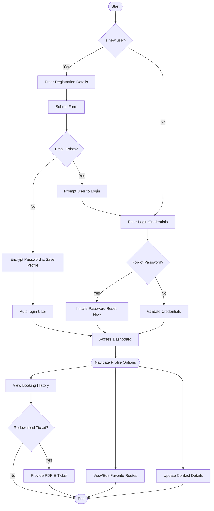
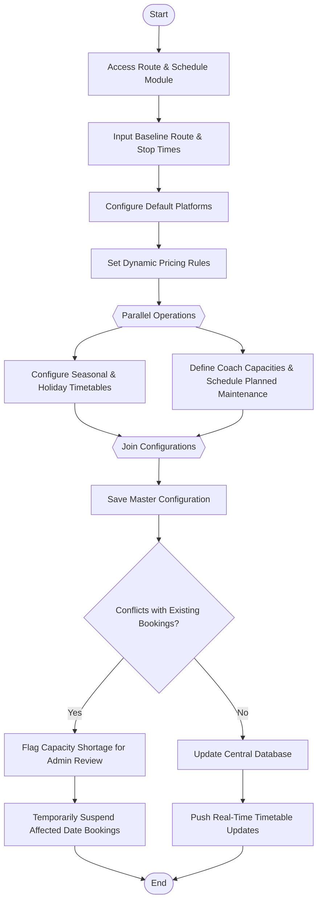
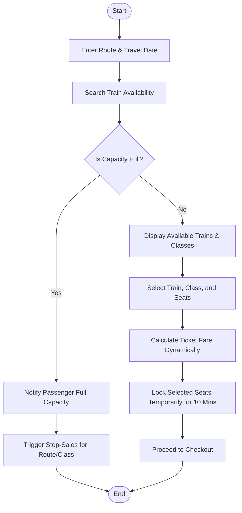
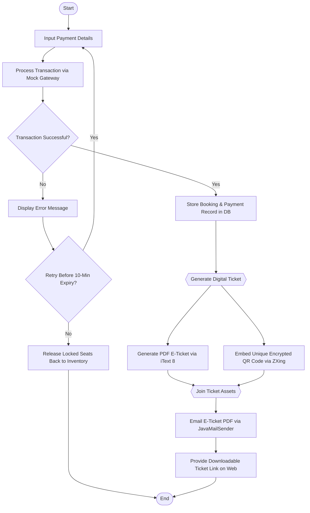
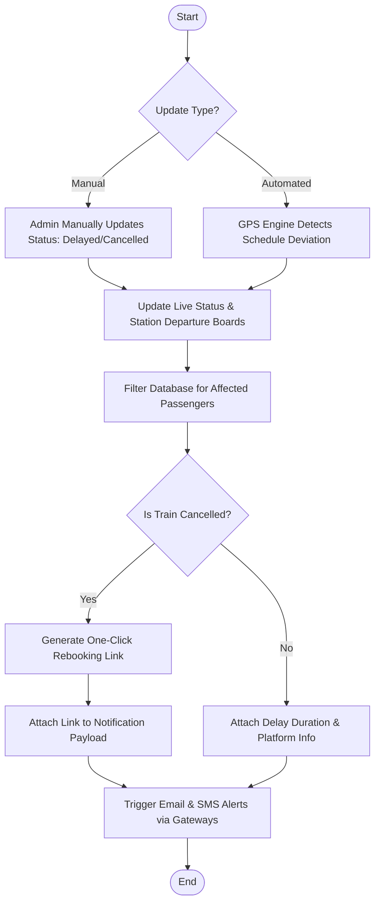
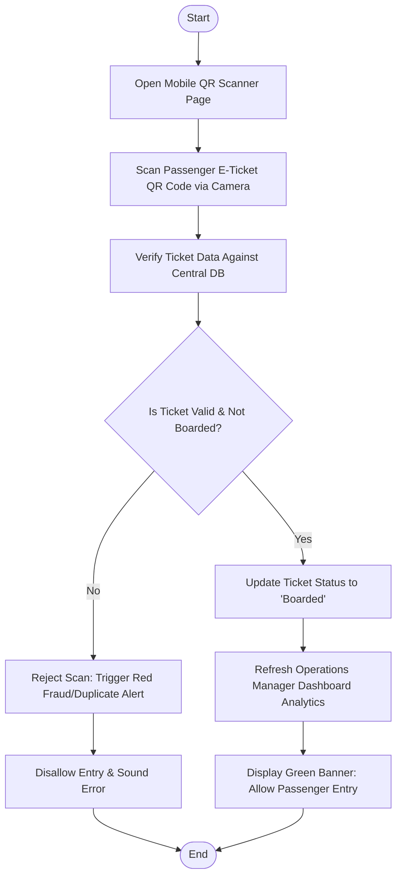
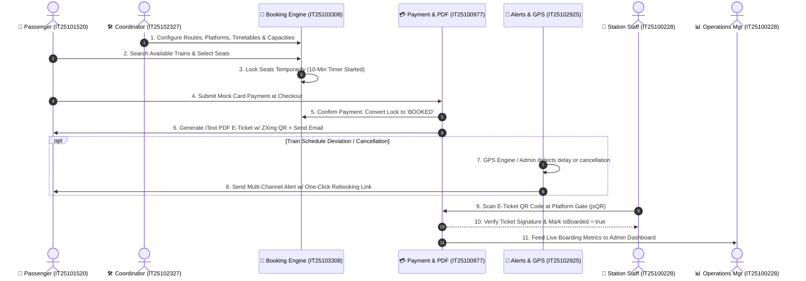
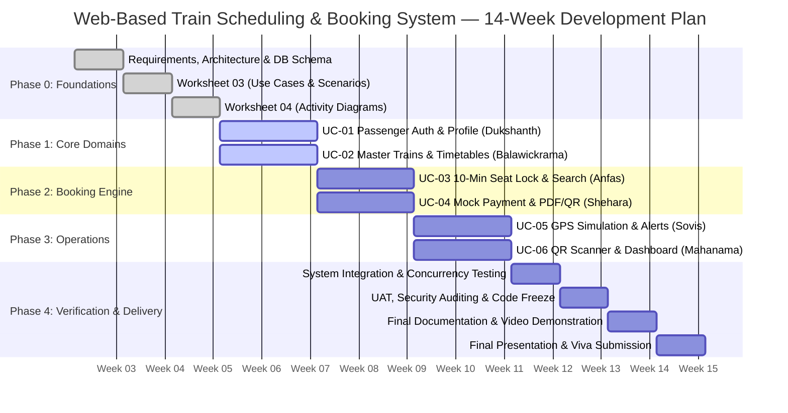

# 📋 Project Implementation Plan & Engineering Roadmap

> **SE2030 — Software Engineering | Year 2, Semester 1 — 2026**  
> **Sri Lanka Institute of Information Technology (SLIIT)**  
> **Group ID:** `2026-Y2-S1-MLB-B9G2-10`  
> **Project:** Web-based Train Scheduling & Booking System  
> **Architecture:** Server-Side Rendered (SSR) Java 17 + Spring Boot 3 + Thymeleaf + MySQL Monolith  

---

## 📑 Table of Contents

1. [Executive Summary & Project Scope](#1-executive-summary--project-scope)
2. [Team Structure & Student ID Ownership Matrix](#2-team-structure--student-id-ownership-matrix)
3. [Unified Clean Project Architecture (Organized by Student ID)](#3-unified-clean-project-architecture-organized-by-student-id)
4. [System Architecture & Cross-Cutting Infrastructure](#4-system-architecture--cross-cutting-infrastructure)
5. [Detailed Module Implementation Plans (UC-01 to UC-06)](#5-detailed-module-implementation-plans-uc-01-to-uc-06)
   - [UC-01: Passenger Profile & Account Management (IT25101520)](#uc-01-passenger-profile--account-management-it25101520)
   - [UC-02: Train Route & Schedule Management (IT25102327)](#uc-02-train-route--schedule-management-it25102327)
   - [UC-03: Real-Time Seat Reservation & Capacity Engine (IT25103308)](#uc-03-real-time-seat-reservation--capacity-engine-it25103308)
   - [UC-04: Payment Processing & E-Ticket Generation (IT25100977)](#uc-04-payment-processing--e-ticket-generation-it25100977)
   - [UC-05: Live Status & Automated Notification System (IT25102925)](#uc-05-live-status--automated-notification-system-it25102925)
   - [UC-06: Admin Dashboard & Station Ticket Validation (IT25100228)](#uc-06-admin-dashboard--station-ticket-validation-it25100228)
6. [End-to-End Inter-Module Integration & Data Flow](#6-end-to-end-inter-module-integration--data-flow)
7. [14-Week Development Roadmap & Milestone Schedule](#7-14-week-development-roadmap--milestone-schedule)
8. [Git Collaboration & Branching Strategy](#8-git-collaboration--branching-strategy)
9. [Testing & Quality Assurance Strategy](#9-testing--quality-assurance-strategy)
10. [Risk Management & Mitigation Plan](#10-risk-management--mitigation-plan)
11. [SLIIT Coursework Deliverables & Evaluation Checklist](#11-sliit-coursework-deliverables--evaluation-checklist)

---

## 1. Executive Summary & Project Scope

The **Web-based Train Scheduling & Booking System** is a unified digital platform built to solve chronic operational inefficiencies in passenger rail transit. Built directly as a single root-level Spring Boot 3 and Thymeleaf monolith, it eliminates redundant subdirectory nesting and integrates both the presentation layer and the backend engine seamlessly.

### Key Innovations of the Platform:
1. **Concurrency-Safe Atomic Booking**: 10-minute temporary seat lock timers prevent double-booking across peak concurrent sessions.
2. **Dynamic Operations & Timetables**: Admin tools for platform allocations, dynamic fare calculation, seasonal schedule overrides, and maintenance block tracking.
3. **Automated Delay & GPS Simulation Intelligence**: Dual-trigger updates (manual coordinator input or automated GPS tracking simulation) updating departure boards, triggering email/SMS alerts, and generating One-Click Rebooking links for cancellations.
4. **Paperless Anti-Fraud Ticketing**: High-definition PDF E-Tickets with encrypted QR codes verified at station gates via mobile browser cameras (`jsQR`), immediately rejecting duplicate scans and feeding live boarding data to the executive dashboard.

---

## 2. Team Structure & Student ID Ownership Matrix

Every team member has sole ownership of one major functional module. Code, templates, and unit tests are strictly compartmentalized using each member's Student ID inside the project:

| Student ID | Member Name | Assigned Module | Priority | Target Actors | Java Package | UI View Directory | Test Package |
|:---|:---|:---|:---:|:---|:---|:---|:---|
| **IT25101520** | **Dukshanth K.** | **UC-01**: Passenger Profile & Account Management | 4 | Passenger (End-User) | `com.trainbooking.it25101520.*` | `templates/it25101520/` | `test/.../it25101520/` |
| **IT25102327** | **Balawickrama B.R.D.** | **UC-02**: Train Route & Schedule Management | 5 | Schedule Coordinator (Admin) | `com.trainbooking.it25102327.*` | `templates/it25102327/` | `test/.../it25102327/` |
| **IT25103308** | **Anfas M.S.** | **UC-03**: Real-Time Seat Reservation & Capacity Engine | 5 | Passenger (End-User) | `com.trainbooking.it25103308.*` | `templates/it25103308/` | `test/.../it25103308/` |
| **IT25100977** | **Shehara D.M.D.** | **UC-04**: Payment Processing & E-Ticket Generation | 5 | Passenger, Payment Gateway (Mock), Email Gateway | `com.trainbooking.it25100977.*` | `templates/it25100977/` | `test/.../it25100977/` |
| **IT25102925** | **Sovis W.M.A.V.** | **UC-05**: Live Status & Automated Notification System | 4 | Schedule Coordinator, GPS Tracking Engine, Email/SMS Gateway | `com.trainbooking.it25102925.*` | `templates/it25102925/` | `test/.../it25102925/` |
| **IT25100228** | **Mahanama M.N.S.T.** | **UC-06**: Admin Dashboard & Station Ticket Validation | 5 | Operations Manager, Station Staff | `com.trainbooking.it25100228.*` | `templates/it25100228/` | `test/.../it25100228/` |

---

## 3. Unified Clean Project Architecture (Organized by Student ID)

The project is structured as a **single root-level Maven project** without any unnecessary outer folders. Each team member has a dedicated development package containing their controllers, services, entities/models, repositories, DTOs, matching UI templates, and test suites:

```
project/
├── pom.xml                                      ← Master Maven build descriptor (Java 17, Spring Boot 3.2.5)
├── README.md                                    ← Master project documentation & system overview
├── plan.md                                      ← Engineering roadmap, specifications & milestone plan
├── 2026-Y2-S1-MLB-B9G2-10_lab03.pdf             ← Worksheet 03: Use Case Diagrams & Specifications
├── 2026-Y2-S1-MLB-B9G2-10_Activity.pdf          ← Worksheet 04: Activity Diagrams & Scenarios
│
└── src/
    ├── main/
    │   ├── java/com/trainbooking/
    │   │   ├── TrainBookingApplication.java     ← Main entry point (@SpringBootApplication)
    │   │   │
    │   │   ├── config/                          ← Cross-cutting configuration (Security, WebMvc, Swagger)
    │   │   ├── security/                        ← JWT utilities and UserDetailsService
    │   │   ├── exception/                       ← Global exception handler & custom exceptions
    │   │   │
    │   │   ├── it25101520/                      ← 👤 Dukshanth K. (UC-01: Passenger Profile & Auth)
    │   │   │   ├── controller/                  (AuthController, PassengerController)
    │   │   │   ├── service/                     (AuthService, PassengerService)
    │   │   │   ├── model/                       (User, FavoriteRoute)
    │   │   │   ├── repository/                  (UserRepository, FavoriteRouteRepository)
    │   │   │   └── dto/                         (LoginRequest, RegisterRequest, UserProfileDto, etc.)
    │   │   │
    │   │   ├── it25102327/                      ← 👤 Balawickrama B.R.D. (UC-02: Route & Schedules)
    │   │   │   ├── controller/                  (TrainController, ScheduleController)
    │   │   │   ├── service/                     (TrainService, ScheduleService)
    │   │   │   ├── model/                       (Train, Route, Schedule)
    │   │   │   ├── repository/                  (TrainRepository, RouteRepository, ScheduleRepository)
    │   │   │   └── dto/                         (TrainDto, RouteDto, ScheduleDto, etc.)
    │   │   │
    │   │   ├── it25103308/                      ← 👤 Anfas M.S. (UC-03: Seat Reservation & Capacity)
    │   │   │   ├── controller/                  (BookingController)
    │   │   │   ├── service/                     (BookingService)
    │   │   │   ├── model/                       (Booking)
    │   │   │   ├── repository/                  (BookingRepository)
    │   │   │   └── dto/                         (BookingRequest, BookingResponseDto)
    │   │   │
    │   │   ├── it25100977/                      ← 👤 Shehara D.M.D. (UC-04: Payment & E-Ticketing)
    │   │   │   ├── controller/                  (PaymentController)
    │   │   │   ├── service/                     (PaymentService)
    │   │   │   ├── model/                       (Payment, Ticket)
    │   │   │   ├── repository/                  (PaymentRepository, TicketRepository)
    │   │   │   └── dto/                         (PaymentRequest)
    │   │   │
    │   │   ├── it25102925/                      ← 👤 Sovis W.M.A.V. (UC-05: Live Status & Notifications)
    │   │   │   ├── controller/                  (NotificationController)
    │   │   │   ├── service/                     (NotificationService, EmailService)
    │   │   │   ├── model/                       (Notification)
    │   │   │   ├── repository/                  (NotificationRepository)
    │   │   │   └── dto/                         (NotificationDto)
    │   │   │
    │   │   └── it25100228/                      ← 👤 Mahanama M.N.S.T. (UC-06: Dashboard & QR Validation)
    │   │       ├── controller/                  (DashboardController, TicketValidationController)
    │   │       ├── service/                     (DashboardService, TicketValidationService)
    │   │       └── dto/                         (DashboardStatsDto, ValidationResultDto)
    │   │
    │   └── resources/
    │       ├── application.properties           ← Database, mail, JPA, and JWT configurations
    │       ├── application-dev.properties       ← Local development properties
    │       ├── static/                          ← Static web assets (CSS, JS, images)
    │       │   ├── css/                         (variables.css, global.css)
    │       │   ├── js/                          (main.js, qr-scanner.js)
    │       │   └── images/
    │       │
    │       └── templates/                       ← 🎨 Server-Side Thymeleaf Templates by Student ID
    │           ├── it25101520/                  (login.html, register.html, forgot-password.html, profile.html)
    │           ├── it25102327/                  (manage.html, search.html)
    │           ├── it25103308/                  (seat-select.html)
    │           ├── it25100977/                  (payment.html, eticket.html)
    │           ├── it25102925/                  (list.html, status.html)
    │           ├── it25100228/                  (index.html, validate.html)
    │           ├── layout/                      (base.html, admin-base.html)
    │           └── error/                       (404.html, 500.html)
    │
    └── test/java/com/trainbooking/              ← 🧪 Unit & Integration Tests by Student ID
        ├── it25101520/                          (AuthServiceTest, PassengerServiceTest)
        ├── it25102327/                          (TrainServiceTest, ScheduleServiceTest)
        ├── it25103308/                          (BookingConcurrencyTest, SeatLockTest)
        ├── it25100977/                          (PaymentServiceTest, PdfTicketServiceTest)
        ├── it25102925/                          (NotificationServiceTest, GpsSimulationTest)
        └── it25100228/                          (DashboardServiceTest, TicketValidationTest)
```

---

## 4. System Architecture & Cross-Cutting Infrastructure

The platform runs as a high-performance, monolithic Spring Boot application directly at the root level. All views are server-rendered using Thymeleaf, while RESTful JSON endpoints support dynamic client operations such as mobile QR scanning and real-time station departure board polling.

### Technology Stack & Justification

| Layer | Component | Description & Rationale |
|:---|:---|:---|
| **Runtime & Language** | **Java 17 LTS** | Strong typing, pattern matching, record types, and modern JVM performance. |
| **Application Framework** | **Spring Boot 3.2.5** | Auto-configuration, dependency injection, and integrated Tomcat server. |
| **Security & Auth** | **Spring Security 6** | Role-Based Access Control (RBAC), BCrypt password hashing, session management. |
| **Data Persistence** | **Spring Data JPA & Hibernate** | Object-Relational Mapping, query abstraction, and `@Transactional` isolation. |
| **Database** | **MySQL 8.0** | Relational integrity, ACID compliance, and foreign key constraints. |
| **UI Templating** | **Thymeleaf 3** | Server-side rendering without complex separate frontend build tools. |
| **PDF Generation** | **iText 8** | Dynamic generation of branded railway E-Tickets with structured travel details. |
| **Barcode / QR** | **ZXing 3.5.3** | High-density QR code generation encoding cryptographically signed ticket payloads. |
| **Mail Gateway** | **Spring Boot Starter Mail** | Asynchronous email dispatch via JavaMailSender. |
| **QR Code Scanner** | **jsQR (Browser JS)** | Real-time camera video stream decoding via HTML5 Canvas for station gate staff. |
| **Interactive Charts** | **Chart.js (CDN)** | Interactive revenue and passenger volume dashboards for management. |

---

## 5. Detailed Module Implementation Plans (UC-01 to UC-06)

---

### UC-01: Passenger Profile & Account Management (IT25101520)
- **Lead Developer**: Dukshanth K. (IT25101520)
- **Priority**: 4
- **Primary Actor**: Passenger (End-User)

#### 1. Functional Scope & Business Rules
1. **User Registration**:
   - Validates that email is unique in the central database.
   - Encrypts password using BCrypt (`BCryptPasswordEncoder` strength 12).
   - Assigns default role `ROLE_PASSENGER`.
   - On successful registration, creates user record and automatically authenticates the user into the active session.
   - If email is already registered, rejects submission and prompts passenger to log in.
2. **User Authentication & Password Reset**:
   - Secure login form handling bad credential exceptions.
   - Self-service password reset flow with email verification token.
3. **Profile & Favorites Management**:
   - Update contact telephone, display name, and communication preferences.
   - Save frequently searched origin-destination pairs ("Favorite Routes") for one-click rebooking.
4. **Booking History & Ticket Re-download**:
   - View list of all active, past, and cancelled reservations.
   - One-click re-download of generated PDF E-Tickets.

#### 2. Key Entities & Database Schema
- `User`: `id (PK)`, `email (Unique)`, `password`, `fullName`, `phone`, `role (PASSENGER/COORDINATOR/ADMIN/STATION_STAFF)`, `createdAt`
- `FavoriteRoute`: `id (PK)`, `userId (FK)`, `originStation`, `destinationStation`, `travelClass`, `savedAt`

#### 3. Controller Endpoints
- `GET /login`, `POST /login`
- `GET /register`, `POST /register`
- `GET /forgot-password`, `POST /forgot-password`
- `GET /passenger/profile`, `POST /passenger/profile`
- `GET /passenger/favorites`, `POST /passenger/favorites/add`, `POST /passenger/favorites/{id}/delete`
- `GET /passenger/booking-history`

#### 4. Activity Diagram Flow


---

### UC-02: Train Route & Schedule Management (IT25102327)
- **Lead Developer**: Balawickrama B.R.D. (IT25102327)
- **Priority**: 5
- **Primary Actor**: Schedule Coordinator (Admin)

#### 1. Functional Scope & Business Rules
1. **Master Train Fleet & Route Configuration**:
   - Full CRUD for train models, physical coach counts, and seating capacities per class (First Class, Second Class, Economy).
   - Route network management: standard distance (km), intermediate stations, default stop times.
2. **Default Platform Allocation**:
   - Assign specific physical platforms per station to avoid track bottlenecks.
   - System validates platform conflicts when overlapping trains are scheduled at the same station.
3. **Dynamic Pricing Rules Engine**:
   - Base fare per km multiplied by class coefficients.
   - Peak-hour, weekend, and seasonal demand multipliers configurable per route.
4. **Seasonal & Holiday Timetable Overrides**:
   - Schedule special seasonal timetables (e.g., Sinhala/Tamil New Year, Christmas, Long Weekends) that automatically override baseline timetables for defined date ranges.
5. **Planned Maintenance Blocks & Conflict Review**:
   - Mark specific train coaches or entire train sets for scheduled maintenance.
   - If a maintenance block overlaps with an active schedule with existing bookings, the system flags the capacity shortage for administrative review and temporarily suspends further bookings for the affected dates.
6. **Real-Time Timetable Push**:
   - Instantly updates the central database and pushes timetable changes live to the search engine.

#### 2. Key Entities & Database Schema
- `Train`: `id (PK)`, `trainNumber (Unique)`, `trainName`, `trainType`, `firstClassCapacity`, `secondClassCapacity`, `economyCapacity`, `isActive`
- `Route`: `id (PK)`, `originStation`, `destinationStation`, `distanceKm`, `defaultPlatform`
- `Schedule`: `id (PK)`, `trainId (FK)`, `routeId (FK)`, `departureTime`, `arrivalTime`, `baseFare`, `status (ON_TIME/DELAYED/CANCELLED)`, `isSeasonal`, `isMaintenanceBlocked`

#### 3. Controller Endpoints
- `GET /trains/manage`
- `POST /trains/create`, `POST /trains/{id}/update`, `POST /trains/{id}/delete`
- `GET /schedules/manage`, `POST /schedules/create`, `POST /schedules/{id}/update`
- `POST /schedules/seasonal/override`
- `POST /schedules/maintenance/block`

#### 4. Activity Diagram Flow


---

### UC-03: Real-Time Seat Reservation & Capacity Engine (IT25103308)
- **Lead Developer**: Anfas M.S. (IT25103308)
- **Priority**: 5
- **Primary Actor**: Passenger (End-User)

#### 1. Functional Scope & Business Rules
1. **Live Search & Class Availability**:
   - Filter trains by origin station, destination station, travel date, and preferred seating class.
   - Displays real-time remaining seat capacity per coach class.
2. **Interactive Coach Seat Selection**:
   - Visual seat map showing Available (green), Temporarily Locked (yellow), and Booked (red) seats.
3. **Dynamic Ticket Fare Calculation**:
   - Calculates exact ticket fare based on distance, class multiplier, dynamic demand rules, and number of seats selected.
4. **10-Minute Temporary Seat Lock Timer**:
   - When a passenger selects seats and clicks proceed, the system places a temporary **10-minute lock** on those seats.
   - `@Transactional` atomic database isolation prevents concurrent users from locking or purchasing the same seats.
   - A live JavaScript countdown timer runs on the client checkout screen.
   - If payment is completed within 10 minutes, seats are permanently marked `BOOKED`.
   - If the timer expires or checkout is abandoned, the system automatically unlocks the seats and restores them to inventory.
5. **Stop-Sales Trigger**:
   - If remaining seats reach zero, sales are automatically halted for that class/train.

#### 2. Key Entities & Database Schema
- `Booking`: `id (PK)`, `bookingRef (Unique)`, `userId (FK)`, `scheduleId (FK)`, `travelDate`, `travelClass`, `seatCount`, `totalAmount`, `status (PENDING_PAYMENT/CONFIRMED/CANCELLED/EXPIRED)`, `createdAt`
- `SeatInventory`: `id (PK)`, `scheduleId (FK)`, `travelDate`, `coachNumber`, `seatNumber`, `seatClass`, `lockStatus (AVAILABLE/LOCKED/BOOKED)`, `lockedByUserId`, `lockedAt`, `lockExpiresAt`

#### 3. Controller Endpoints
- `GET /trains/search`
- `GET /booking/seats?scheduleId=&date=`
- `POST /booking/lock`
- `POST /booking/release`

#### 4. Activity Diagram Flow


---

### UC-04: Payment Processing & E-Ticket Generation (IT25100977)
- **Lead Developer**: Shehara D.M.D. (IT25100977)
- **Priority**: 5
- **Primary Actor**: Passenger (End-User)
- **Secondary Actors**: Payment Gateway (Mock), Email Gateway

#### 1. Functional Scope & Business Rules
1. **Mock Payment Gateway Integration**:
   - Secure checkout form validating cardholder name, 16-digit card number, expiry date (MM/YY), and CVV.
   - Simulates external payment gateway authorization.
2. **Transaction Failure & Retry Workflow**:
   - If payment is declined, the system displays an error explanation and offers an immediate retry before the 10-minute seat lock expires.
   - If checkout is explicitly cancelled, the temporary seat lock is released immediately.
3. **Atomic Booking Confirmation**:
   - Upon payment authorization, the system stores transaction records, converts seat locks to `BOOKED`, and confirms the reservation.
4. **PDF E-Ticket Generation (iText 8)**:
   - Compiles a high-resolution PDF document displaying SLIIT Railway branding, Booking Reference, Passenger Name, Train Number, Route, Departure/Arrival Times, Coach/Seat Numbers, and Fare Paid.
5. **Encrypted QR Code Embedding (ZXing)**:
   - Generates a 2D QR barcode embedding an encrypted cryptographic verification token (Booking ID + Ticket Hash + Salt) directly onto the PDF.
6. **Dual Ticket Delivery**:
   - Automated email dispatch attaching the PDF E-Ticket via `JavaMailSender`.
   - Instant downloadable link and preview rendered on the web portal confirmation page.

#### 2. Key Entities & Database Schema
- `Payment`: `id (PK)`, `bookingId (FK)`, `transactionId (Unique)`, `amount`, `paymentMethod`, `paymentStatus (SUCCESS/FAILED)`, `paidAt`
- `Ticket`: `id (PK)`, `ticketNumber (Unique)`, `bookingId (FK)`, `qrCodeData`, `pdfFilePath`, `isBoarded (Boolean)`, `issuedAt`

#### 3. Controller Endpoints
- `GET /payment/checkout/{bookingId}`
- `POST /payment/process`
- `GET /payment/ticket/{ticketId}`
- `GET /payment/ticket/{ticketId}/download`

#### 4. Activity Diagram Flow


---

### UC-05: Live Status & Automated Notification System (IT25102925)
- **Lead Developer**: Sovis W.M.A.V. (IT25102925)
- **Priority**: 4
- **Primary Actors**: Schedule Coordinator (Admin), GPS Tracking Engine
- **Secondary Actors**: Passenger (End-User), Email/SMS Gateway

#### 1. Functional Scope & Business Rules
1. **Dual Status Update Triggers**:
   - **Manual Input**: Schedule Coordinator manually updates operational train status via admin controls.
   - **Automated GPS Simulation**: A background engine periodically simulates train GPS positions, comparing real-time simulated checkpoint arrival with master timetable standards to detect delays automatically.
2. **Real-Time Timetable & Departure Board Synchronization**:
   - Status changes immediately reflect on the public web station departure boards.
3. **Database Filtering for Affected Passengers**:
   - Queries `Booking` and `User` tables to isolate all passengers holding active confirmed tickets for the delayed or cancelled service.
4. **Targeted Multi-Channel Alerts (Email & SMS)**:
   - Dispatches formatted alert emails via `JavaMailSender`.
   - Sends simulated SMS notifications detailing new expected arrival times and platform changes.
5. **One-Click Cancellation Rebooking Integration**:
   - When a train is **Cancelled**, the alert email/SMS includes a secure, one-click rebooking link.
   - Clicking the link transfers the passenger to the next available train on the same route **without any additional payment processing**.

#### 2. Key Entities & Database Schema
- `Notification`: `id (PK)`, `userId (FK)`, `trainId (FK)`, `notificationType (DELAY/CANCELLATION/PLATFORM_CHANGE)`, `channel (EMAIL/SMS)`, `message`, `status (SENT/FAILED)`, `sentAt`
- `RebookingToken`: `id (PK)`, `bookingId (FK)`, `secureToken (Unique)`, `isRedeemed`, `expiresAt`

#### 3. Controller Endpoints
- `POST /trains/{id}/status`
- `GET /departure-board`
- `GET /notifications/passenger`
- `GET /rebooking/claim/{token}`

#### 4. Activity Diagram Flow


---

### UC-06: Admin Dashboard & Station Ticket Validation (IT25100228)
- **Lead Developer**: Mahanama M.N.S.T. (IT25100228)
- **Priority**: 5
- **Primary Actors**: Operations Manager, Station Staff
- **Secondary Actor**: Passenger (End-User)

#### 1. Functional Scope & Business Rules
1. **Executive Operational Dashboard (Operations Manager)**:
   - Aggregates daily KPI statistics: Gross Revenue, Active Trains, Passenger Volume, Capacity Utilization %, and Average Delay Minutes.
   - Interactive revenue breakdowns and route demand charts rendered using Chart.js.
2. **Mobile Web QR Ticket Scanner (Station Staff)**:
   - Runs directly in mobile browsers using `getUserMedia` camera feed decoded in real-time by `jsQR`.
   - No native app installation needed for station staff.
3. **Real-Time Verification & Anti-Fraud Engine**:
   - Submits scanned QR token payload to `POST /validate`.
   - Verifies ticket existence, matching train number, correct travel date, and boarding status.
4. **Duplicate Scan / Fraud Rejection**:
   - If ticket is already marked `isBoarded = true`, the scanner triggers a prominent **vivid red error screen** with alert sound, rejecting passenger entry.
   - If ticket is for a different train or route, displays specific rejection reason.
5. **Boarding Confirmation & Live Dashboard Refresh**:
   - Valid unboarded tickets are atomically updated to `isBoarded = true`.
   - Displays a green confirmation screen showing passenger name, class, and seat number.
   - Boarding events dynamically increment the Operations Manager's live passenger count.
6. **Network Connectivity Assumption**:
   - Scanner requires stable network connectivity to communicate with central validation endpoints.

#### 2. Key Entities & Database Schema
- `BoardingLog`: `id (PK)`, `ticketId (FK)`, `scannedByStaffId (FK)`, `stationCode`, `scanResult (VALID/DUPLICATE/WRONG_TRAIN/EXPIRED)`, `scannedAt`

#### 3. Controller Endpoints
- `GET /dashboard`
- `GET /dashboard/revenue`
- `GET /dashboard/stats`
- `GET /validate`
- `POST /validate`

#### 4. Activity Diagram Flow


---

## 6. End-to-End Inter-Module Integration & Data Flow



---

## 7. 14-Week Development Roadmap & Milestone Schedule



### Detailed Week-by-Week Deliverables

| Week | Phase | Milestone Objectives | Responsible Members | Key Deliverable Artifacts |
|:---:|:---|:---|:---|:---|
| **W1–W2** | Inception | Problem statement, team roles, requirements capture | All Members | Software Requirement Specification (SRS) |
| **W5–W6** | Phase 1 | Spring Boot 3 foundation, BCrypt auth, master train/schedule CRUD | IT25101520, IT25102327 | `it25101520` (Auth/Profile), `it25102327` (Train/Route CRUD) |
| **W7–W8** | Phase 2 | Real-time seat reservation engine, 10-min lock timer, mock payment gateway, iText PDF & ZXing QR generation | IT25103308, IT25100977 | `it25103308` (Booking/Lock), `it25100977` (Payment/Ticket PDF) |
| **W9–W10** | Phase 3 | Automated GPS delay simulation, email/SMS alerts, one-click rebooking, mobile QR scanner & Chart.js dashboard | IT25102925, IT25100228 | `it25102925` (Notifications/GPS), `it25100228` (Dashboard/Validator) |
| **W11** | Phase 4 | End-to-end integration, atomic concurrency load testing, UI styling polish | All Members | Integrated test report, bug-fix commits |
| **W12** | Phase 4 | User Acceptance Testing (UAT), security verification (RBAC & CSRF) | All Members | UAT Sign-off document, security audit |
| **W13** | Delivery | Master `README.md` and project documentation finalization | All Members | Final codebase documentation & video demo |
| **W14** | Delivery | Final project submission, presentation slides, code viva | All Members | Project archive, live demonstration |

---

## 8. Git Collaboration & Branching Strategy

### Branch Hierarchy
```
main (Production releases)
└── develop (Active integration branch)
    ├── feature/IT25101520-passenger-profile
    ├── feature/IT25102327-train-schedules
    ├── feature/IT25103308-seat-reservation
    ├── feature/IT25100977-payment-eticket
    ├── feature/IT25102925-live-notifications
    └── feature/IT25100228-dashboard-validation
```

### Commit Message Standard
- `feat(IT25101520): implement BCrypt user registration and automatic login`
- `feat(IT25102327): add dynamic pricing rules and default platform assignments`
- `feat(IT25103308): implement 10-minute temporary seat lock timer`
- `feat(IT25100977): integrate iText 8 PDF ticket generator and ZXing QR`
- `feat(IT25102925): implement GPS tracking simulation for auto delay detection`
- `feat(IT25100228): integrate jsQR mobile web camera ticket scanner`
- `fix(IT25103308): resolve lock timeout race condition on concurrent seat select`
- `test(IT25100977): add unit tests for payment failure retry logic`

---

## 9. Testing & Quality Assurance Strategy

Testing is conducted across three tiers:

### 1. Unit Testing (JUnit 5 + Mockito)
- Minimum **80% line coverage** required for service layer business logic.
- Each member maintains tests in `src/test/java/com/trainbooking/<student-id>/`.

### 2. Concurrency & Seat Locking Verification
- Multi-threaded JUnit tests simulating simultaneous requests for the same seat.
- Validates that only one passenger acquires the lock while others receive an HTTP `409 Conflict` or graceful seat unavailable notification.

### 3. Integration & Web UI Testing (MockMvc)
- Verifies Spring Security role authorization and CSRF validation.

---

## 10. Risk Management & Mitigation Plan

| # | Identified Risk | Severity | Likelihood | Proactive Mitigation Strategy |
|:---:|:---|:---:|:---:|:---|
| 1 | **Concurrent Double-Booking** | Critical | High | Implement atomic `@Transactional` isolation in `BookingService` with database row-level locking. |
| 2 | **10-Min Seat Lock Zombie State** | High | Medium | Scheduled Spring task (`@Scheduled`) runs every 60 seconds to release seats where `lockExpiresAt < now()`. |
| 3 | **Payment Failure & Frustrated User** | Medium | Medium | Implement instant payment retry workflow allowing passenger to re-enter details without losing seat lock. |
| 4 | **Unreliable Station Staff Internet** | High | High | Explicit error handling in `jsQR` scanner: prompts staff to reconnect and caches offline scan alerts safely. |
| 5 | **Mass Cancellation Alert Congestion** | Medium | Medium | Asynchronous notification dispatch using `@Async` so passenger alert generation does not block the web server. |
| 6 | **Git Merge Collisions** | High | Low | Codebase compartmentalized by Student ID folders (`it25101520` to `it25100228`); shared files managed via strict PR reviews. |

---

## 11. SLIIT Coursework Deliverables & Evaluation Checklist

- [x] **Root-Level Monolith Restructuring**: Single root Maven project without `backend/` or `members/` outer wrappers.
- [x] **Code & Templates Partitioning**: Organized by Student ID (`it25101520`, `it25102327`, `it25103308`, `it25100977`, `it25102925`, `it25100228`).
- [x] **Master Documentation**: Comprehensive `README.md` updated with zero functional reduction.
- [x] **Implementation Roadmap**: Exhaustive `plan.md` created.
- [ ] **Phase 1 Code Delivery**: Authentication, Passenger Profile, and Master Timetables.
- [ ] **Phase 2 Code Delivery**: Seat Locking Reservation Engine and Payment/PDF Generation.
- [ ] **Phase 3 Code Delivery**: GPS Live Status Engine and Station QR Validation Dashboard.
- [ ] **Phase 4 Testing & UAT**: Integration test report and coverage analysis (>80%).
- [ ] **Final Submission & Viva**: Video demonstration, slide deck, and live software demonstration.
